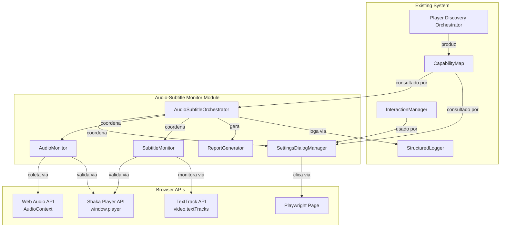
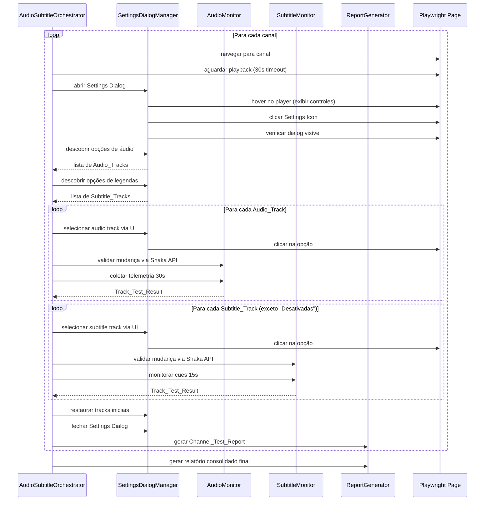
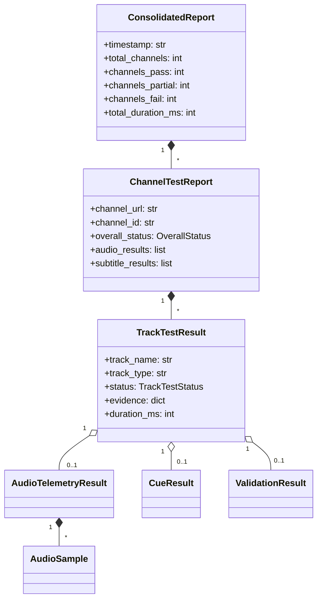

# Design Document: Audio & Subtitle Monitoring via UI

## Overview

Este documento descreve o design técnico do módulo de **Monitoramento de Áudio e Legendas via UI** — um sistema que testa funcionalidades de áudio e legendas interagindo diretamente com os controles visuais do player SKY+ (Settings Dialog) e validando os resultados via Shaka Player API, Web Audio API e TextTrack API.

### Motivação

O Player Discovery existente já detecta capabilities e coleta telemetria passiva (AudioProbe, SubtitleProbe). Porém, não executa testes funcionais completos de **troca de track via UI** — que é o caminho real do usuário. Este módulo preenche essa lacuna ao:

1. Clicar nas opções do Settings Dialog (como um usuário faria)
2. Validar via API que a mudança realmente ocorreu (cross-validation UI vs API)
3. Coletar telemetria extendida (30s de áudio, cues de legenda) para cada track
4. Produzir relatório consolidado por canal com evidências

### Decisões de Design

| Decisão | Rationale |
|---------|-----------|
| Módulo separado em `src/audio_subtitle_monitor/` | Separação de responsabilidades — não polui o Player Discovery existente |
| Reutiliza `CapabilityMap` e `InteractionManager` | Consistência arquitetural e reutilização de discovery |
| Interação via UI (não API direta) | Testa o caminho real do usuário; detecta bugs de UI |
| Validação cruzada UI vs Shaka API | Garante que cliques na UI têm efeito real |
| Execução sequencial por canal | Simplicidade; evita race conditions com o player |
| Telemetria de 30s por audio track | Tempo suficiente para detectar silêncio intermitente |
| Timeout de 15s para cues de legenda | Cues dependem do conteúdo ao vivo; margem generosa |

---

## Architecture

### Diagrama de Alto Nível



### Fluxo Principal de Execução



---

## Components and Interfaces

### 1. AudioSubtitleOrchestrator

**Responsabilidade**: Coordena o fluxo completo de testes de áudio e legendas em múltiplos canais.

```python
class AudioSubtitleOrchestrator:
    """Orquestrador principal do módulo de monitoramento de áudio e legendas."""

    def __init__(
        self,
        page: Page,
        capability_map: CapabilityMap,
        config: AudioSubtitleConfig,
    ) -> None: ...

    async def run(self, channels: list[str]) -> ConsolidatedReport:
        """Executa testes em todos os canais configurados."""
        ...

    async def run_channel(self, channel_url: str) -> ChannelTestReport:
        """Executa Monitoring_Session completa para um canal."""
        ...

    async def _wait_for_playback(self, timeout_s: float = 30.0) -> bool:
        """Aguarda player iniciar reprodução (currentTime avançando)."""
        ...

    async def _navigate_to_channel(self, url: str) -> bool:
        """Navega para canal e aguarda DOM carregado."""
        ...
```

### 2. SettingsDialogManager

**Responsabilidade**: Gerencia abertura, fechamento e interação com o Settings Dialog do player.

```python
class SettingsDialogManager:
    """Gerencia interações com o Settings Dialog do player SKY+."""

    def __init__(
        self,
        page: Page,
        capability_map: CapabilityMap,
        interaction_manager: InteractionManager,
    ) -> None: ...

    async def open_dialog(self) -> bool:
        """Abre o Settings Dialog (hover + clique no Settings_Icon)."""
        ...

    async def close_dialog(self) -> bool:
        """Fecha o Settings Dialog (Escape ou clique fora)."""
        ...

    async def ensure_dialog_open(self) -> bool:
        """Garante que o dialog está aberto; reabre se necessário."""
        ...

    async def discover_audio_options(self) -> list[TrackOption]:
        """Coleta opções da Audio_Section ('IDIOMA ALTERNATIVO')."""
        ...

    async def discover_subtitle_options(self) -> list[TrackOption]:
        """Coleta opções da Subtitle_Section ('LEGENDAS')."""
        ...

    async def select_option(self, section: str, option_text: str) -> bool:
        """Clica em uma opção dentro de uma seção do dialog."""
        ...

    async def get_selected_option(self, section: str) -> str | None:
        """Retorna o texto da opção atualmente selecionada em uma seção."""
        ...

    async def _show_player_controls(self) -> None:
        """Move cursor sobre o player para exibir barra de controles."""
        ...

    async def _find_settings_icon(self) -> Locator | None:
        """Localiza o Settings_Icon usando estratégia do CapabilityMap."""
        ...
```

### 3. AudioMonitor

**Responsabilidade**: Valida mudanças de áudio via Shaka API e coleta telemetria via Web Audio API.

```python
class AudioMonitor:
    """Monitora e valida funcionalidade de áudio."""

    def __init__(self, page: Page) -> None: ...

    async def validate_track_switch(
        self, expected_language: str, timeout_s: float = 5.0
    ) -> ValidationResult:
        """Verifica via Shaka API que o track ativo mudou."""
        ...

    async def collect_telemetry(
        self, duration_s: float = 30.0, sample_interval_s: float = 2.0
    ) -> AudioTelemetryResult:
        """Coleta telemetria de áudio durante a janela especificada."""
        ...

    async def get_active_tracks(self) -> list[dict]:
        """Consulta window.player.getAudioTracks() via Shaka API."""
        ...

    def classify_result(self, telemetry: AudioTelemetryResult) -> TrackTestStatus:
        """Classifica resultado: PASS se >=80% amostras com RMS > 0.01."""
        ...

    async def _init_audio_context(self) -> bool:
        """Inicializa Web Audio API AudioContext."""
        ...

    async def _collect_single_sample(self) -> AudioSample:
        """Coleta uma única amostra RMS/peak via Web Audio API."""
        ...
```

### 4. SubtitleMonitor

**Responsabilidade**: Valida mudanças de legenda via Shaka API e monitora cues via TextTrack API.

```python
class SubtitleMonitor:
    """Monitora e valida funcionalidade de legendas."""

    def __init__(self, page: Page) -> None: ...

    async def validate_track_switch(
        self, expected_language: str, timeout_s: float = 5.0
    ) -> ValidationResult:
        """Verifica via Shaka API que o track de legenda ativo mudou."""
        ...

    async def wait_for_active_cue(
        self, timeout_s: float = 15.0, poll_interval_s: float = 0.5
    ) -> CueResult:
        """Monitora activeCues na track ativa até timeout."""
        ...

    async def get_active_tracks(self) -> list[dict]:
        """Consulta window.player.getTextTracks() via Shaka API."""
        ...
```

### 5. ReportGenerator

**Responsabilidade**: Gera relatórios JSON consolidados por canal e execução completa.

```python
class ReportGenerator:
    """Gera relatórios consolidados de testes de áudio e legendas."""

    def __init__(self, output_dir: str) -> None: ...

    def create_channel_report(
        self,
        channel_url: str,
        audio_results: list[TrackTestResult],
        subtitle_results: list[TrackTestResult],
        duration_ms: int,
    ) -> ChannelTestReport:
        """Cria Channel_Test_Report com overall_status calculado."""
        ...

    def create_consolidated_report(
        self, channel_reports: list[ChannelTestReport]
    ) -> ConsolidatedReport:
        """Cria relatório final consolidado de todos os canais."""
        ...

    def save_channel_report(self, report: ChannelTestReport) -> str:
        """Serializa e salva relatório no diretório de output."""
        ...

    def _calculate_overall_status(
        self, results: list[TrackTestResult]
    ) -> OverallStatus:
        """PASS se todos PASS, PARTIAL se misto, FAIL se todos FAIL/TIMEOUT."""
        ...
```

---

## Data Models

### Configuração

```python
@dataclass
class AudioSubtitleConfig:
    """Configuração do módulo de monitoramento de áudio e legendas."""

    channels: list[str]
    output_dir: str = "reports/"
    audio_telemetry_window_s: float = 30.0
    audio_sample_interval_s: float = 2.0
    audio_pass_threshold: float = 0.80  # 80% amostras com áudio
    audio_rms_threshold: float = 0.01
    subtitle_cue_timeout_s: float = 15.0
    subtitle_poll_interval_s: float = 0.5
    track_switch_timeout_s: float = 5.0
    playback_wait_timeout_s: float = 30.0
    settings_dialog_timeout_s: float = 5.0
    dialog_retry_wait_s: float = 2.0
```

### Resultado de Track Individual

```python
@dataclass_json
@dataclass
class TrackTestResult:
    """Resultado individual do teste de um track."""

    track_name: str
    track_type: Literal["audio", "subtitle"]
    status: TrackTestStatus  # PASS, FAIL, TIMEOUT
    evidence: dict[str, Any]
    duration_ms: int
    telemetry: dict[str, Any] | None = None
    api_state_before: dict[str, Any] | None = None
    api_state_after: dict[str, Any] | None = None


class TrackTestStatus(Enum):
    """Status do teste de um track."""
    PASS = "PASS"
    FAIL = "FAIL"
    TIMEOUT = "TIMEOUT"
```

### Relatório de Canal

```python
@dataclass_json
@dataclass
class ChannelTestReport:
    """Relatório consolidado de uma Monitoring_Session."""

    channel_url: str
    channel_id: str
    timestamp: str  # ISO 8601
    audio_results: list[TrackTestResult]
    subtitle_results: list[TrackTestResult]
    overall_status: OverallStatus  # PASS, PARTIAL, FAIL
    duration_ms: int
    audio_options_discovered: list[str]
    subtitle_options_discovered: list[str]
    errors: list[str]


class OverallStatus(Enum):
    """Status geral do canal."""
    PASS = "PASS"
    PARTIAL = "PARTIAL"
    FAIL = "FAIL"
```

### Relatório Consolidado

```python
@dataclass_json
@dataclass
class ConsolidatedReport:
    """Relatório consolidado de execução multi-canal."""

    timestamp: str  # ISO 8601
    total_channels: int
    channels_pass: int
    channels_partial: int
    channels_fail: int
    total_duration_ms: int
    channel_reports: list[ChannelTestReport]
```

### Modelos Auxiliares

```python
@dataclass
class TrackOption:
    """Opção de track descoberta no Settings Dialog."""
    text: str
    is_selected: bool
    index: int


@dataclass
class ValidationResult:
    """Resultado de validação cruzada UI vs API."""
    success: bool
    expected_language: str
    actual_active_language: str | None
    api_tracks: list[dict]
    error: str | None = None


@dataclass
class AudioTelemetryResult:
    """Resultado da coleta de telemetria de áudio."""
    samples: list[AudioSample]
    rms_avg: float
    rms_min: float
    rms_max: float
    audio_present_ratio: float  # % de amostras com RMS > threshold
    silence_duration_s: float
    total_duration_s: float


@dataclass
class AudioSample:
    """Uma amostra individual de áudio."""
    timestamp: float
    rms: float
    peak: float


@dataclass
class CueResult:
    """Resultado da espera por cue de legenda."""
    found: bool
    cue_text: str | None = None  # primeiros 50 caracteres
    time_to_first_cue_ms: int | None = None
    error: str | None = None
```

### Diagrama de Relações entre Data Models



---


## Correctness Properties

*A property is a characteristic or behavior that should hold true across all valid executions of a system — essentially, a formal statement about what the system should do. Properties serve as the bridge between human-readable specifications and machine-verifiable correctness guarantees.*

### Property 1: Option Discovery Completeness and Selection

*For any* Settings Dialog DOM containing N options in a section (áudio ou legendas) with exactly one marked as selected, the discovery function SHALL return exactly N TrackOption items where the texts match the DOM content and exactly one has `is_selected=True` matching the DOM state.

**Validates: Requirements 2.1, 2.2, 4.1, 4.2**

### Property 2: UI vs API Cross-Validation

*For any* pair of (UI options list, API tracks list), the validation function SHALL classify as consistent when every UI option has a corresponding API track with matching language, and SHALL classify as "ui_api_mismatch" when the UI indicates a selection that the API does not confirm as active.

**Validates: Requirements 2.3, 4.3, 10.3**

### Property 3: Track Switch Validation

*For any* expected language string and Shaka API response containing a list of tracks (each with language and active fields), the validate_track_switch function SHALL return success=True if and only if there exists a track with matching language marked as active.

**Validates: Requirements 3.2, 5.2, 10.1, 10.2**

### Property 4: Audio Telemetry Aggregation

*For any* non-empty list of RMS samples (floats between 0.0 and 1.0), the aggregation function SHALL produce rms_avg equal to the arithmetic mean, rms_min equal to the minimum value, rms_max equal to the maximum value, and audio_present_ratio equal to the fraction of samples with RMS > 0.01.

**Validates: Requirements 3.3**

### Property 5: Audio Result Classification

*For any* AudioTelemetryResult, the classification function SHALL return PASS if audio_present_ratio >= 0.80 and FAIL if audio_present_ratio < 0.80.

**Validates: Requirements 3.4, 3.5**

### Property 6: Subtitle "Desativadas" Filtering

*For any* list of Subtitle_Tracks containing zero or more items with text "Desativadas", the iteration function SHALL process all tracks EXCEPT those with text "Desativadas", and the number of processed tracks SHALL equal the total minus the count of "Desativadas" entries.

**Validates: Requirements 5.1**

### Property 7: Cue Evidence Formatting

*For any* detected cue with arbitrary text and timing, the evidence dict SHALL contain cue_text truncated to at most 50 characters, track_name matching the selected track, and time_to_first_cue_ms as a non-negative integer.

**Validates: Requirements 5.4**

### Property 8: Track Restoration

*For any* initial track name and any sequence of track selections performed during testing, the final restoration call SHALL target the original initial track name, ensuring the player returns to its pre-test state.

**Validates: Requirements 3.7, 5.7**

### Property 9: Overall Status Calculation

*For any* list of TrackTestResults, the overall_status SHALL be PASS when all statuses are PASS, FAIL when all statuses are FAIL or TIMEOUT (with at least one), and PARTIAL in all other non-empty mixed cases.

**Validates: Requirements 7.2**

### Property 10: Report Serialization Completeness

*For any* valid ChannelTestReport, the JSON serialization SHALL contain all required keys: channel_url, channel_id, timestamp, audio_results, subtitle_results, overall_status, duration_ms. And for each TrackTestResult within, SHALL contain: track_name, track_type, status, evidence, duration_ms, telemetry.

**Validates: Requirements 7.1, 7.4**

### Property 11: Report Filename Format

*For any* channel_id (alphanumeric string) and timestamp (ISO 8601 string), the generated filename SHALL match the pattern `audio_subtitle_report_{channel_id}_{timestamp}.json` with timestamp formatted as a filesystem-safe string.

**Validates: Requirements 7.3**

### Property 12: Consolidated Report Aggregation

*For any* list of ChannelTestReports, the ConsolidatedReport SHALL have total_channels equal to the list length, channels_pass equal to the count of reports with overall_status PASS, channels_partial equal to count of PARTIAL, and channels_fail equal to count of FAIL.

**Validates: Requirements 9.4**

### Property 13: Error Resilience — Channel Continuation

*For any* ordered list of channels where channel at index K raises an exception during its Monitoring_Session, the orchestrator SHALL still execute Monitoring_Sessions for all channels at indices > K, and the final ConsolidatedReport SHALL contain entries for all channels (with error info for the failed one).

**Validates: Requirements 9.5**

### Property 14: API State Recording

*For any* track switch operation (audio or subtitle), the resulting TrackTestResult SHALL contain non-null api_state_before captured prior to the UI click and api_state_after captured after the switch, with both containing the full list of tracks from the respective Shaka API call.

**Validates: Requirements 10.4**

---

## Error Handling

### Estratégia de Erros por Camada

| Camada | Tipo de Erro | Ação |
|--------|-------------|------|
| Navegação | Timeout ao carregar canal | Classificar como "playback_not_started", avançar para próximo canal |
| Settings Dialog | Icon não encontrado | Classificar sessão como FAIL, evidence "settings_dialog_unavailable" |
| Settings Dialog | Dialog não abre (5s timeout) | Retry 1x após 2s; se falhar, FAIL com evidence |
| Settings Dialog | Dialog congelado/não responsivo | Escape + 2s wait + retry 1x |
| Seleção de Track | Opção não clicável | Fechar/reabrir dialog, tentar novamente; FAIL se persistir |
| Validação API | Track switch não confirmado (5s) | FAIL com evidence "track_switch_not_confirmed" |
| Audio Telemetry | AudioContext não inicializa | FAIL com evidence "audio_context_unavailable" |
| Subtitle Cues | Nenhuma cue em 15s | TIMEOUT com evidence "no_active_cues_within_15s" |
| Erro Inesperado | Exception não tratada durante sessão | Log + registro no report + avançar para próximo canal |

### Timeouts Configuráveis

```python
TIMEOUTS = {
    "playback_start": 30.0,      # Aguardar reprodução iniciar
    "settings_dialog_open": 5.0,  # Aguardar dialog aparecer
    "track_switch_confirm": 5.0,  # Aguardar API confirmar mudança
    "audio_telemetry_window": 30.0,  # Janela de coleta de áudio
    "subtitle_cue_wait": 15.0,    # Aguardar cue de legenda
    "dialog_retry_wait": 2.0,     # Espera antes de retry do dialog
}
```

### Política de Retry

- **Settings Dialog**: Máximo 1 retry (fechar + aguardar 2s + reabrir)
- **Track Selection**: Máximo 1 retry (reabrir dialog + tentar novamente)
- **Channel Navigation**: Sem retry (avança para próximo canal)
- **Audio/Subtitle Monitoring**: Sem retry (registra resultado obtido)

### Logging Estruturado

Todos os erros são registrados via `StructuredLogger` com:
- `event_type`: Categoria do evento (ex: "audio_monitor.track_switch.fail")
- `severity`: ERROR, WARNING, INFO
- `channel_id`: Canal onde ocorreu
- `track_name`: Track sendo testado (quando aplicável)
- `evidence`: Detalhes da falha
- `duration_ms`: Tempo até a falha

---

## Testing Strategy

### Abordagem Dual: Unit Tests + Property-Based Tests

Este módulo é adequado para property-based testing porque contém funções puras de classificação, agregação e validação com espaço de entrada amplo.

#### Property-Based Tests (Hypothesis)

**Biblioteca**: [Hypothesis](https://hypothesis.readthedocs.io/) (já presente no projeto — ver `.hypothesis/` na raiz)

**Configuração**:
- Mínimo 100 iterações por property test
- Cada teste referencia a propriedade do design
- Tag format: `Feature: audio-subtitle-monitoring, Property {number}: {title}`

**Properties a implementar**:
1. Option discovery completeness (Property 1)
2. UI vs API cross-validation logic (Property 2)
3. Track switch validation logic (Property 3)
4. Audio telemetry aggregation (Property 4)
5. Audio classification (Property 5)
6. Subtitle "Desativadas" filtering (Property 6)
7. Cue evidence formatting (Property 7)
8. Track restoration (Property 8)
9. Overall status calculation (Property 9)
10. Report serialization completeness (Property 10)
11. Report filename format (Property 11)
12. Consolidated report aggregation (Property 12)
13. Error resilience (Property 13)
14. API state recording (Property 14)

#### Unit Tests (pytest)

**Cenários de exemplo e edge cases**:
- Dialog abre/fecha corretamente (mock Playwright)
- Hover exibe controles do player
- Retry do dialog após freeze
- Canal com playback timeout — skip correto
- Áudio sem AudioContext disponível
- Canal com apenas 1 track de áudio (sem switch possível)
- Legendas todas como "Desativadas" (lista vazia após filtro)
- Cue com texto vazio
- Cue com texto > 50 caracteres (truncamento)
- Channel_id com caracteres especiais no nome do arquivo

#### Integration Tests

**Com Playwright mockado**:
- Fluxo completo de um canal com mocks de page.evaluate
- Sequência de 3 canais com 1 falha no meio — continuidade
- Settings Dialog que fecha automaticamente após seleção
- Settings Dialog que permanece aberto

### Estrutura de Testes

```
tests/
  test_audio_subtitle_monitor/
    test_audio_monitor.py          # Unit + PBT para AudioMonitor
    test_subtitle_monitor.py       # Unit + PBT para SubtitleMonitor
    test_settings_dialog_manager.py  # Unit + PBT para SettingsDialogManager
    test_report_generator.py       # Unit + PBT para ReportGenerator
    test_orchestrator.py           # Unit + PBT para AudioSubtitleOrchestrator
    conftest.py                    # Fixtures compartilhadas (mock page, mock capability_map)
```
