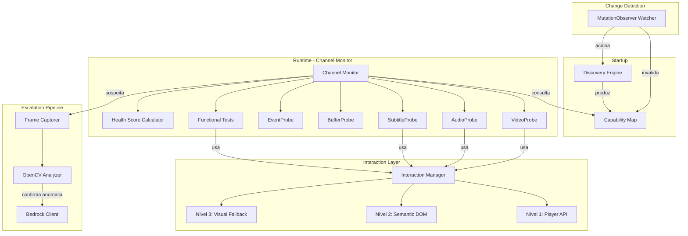
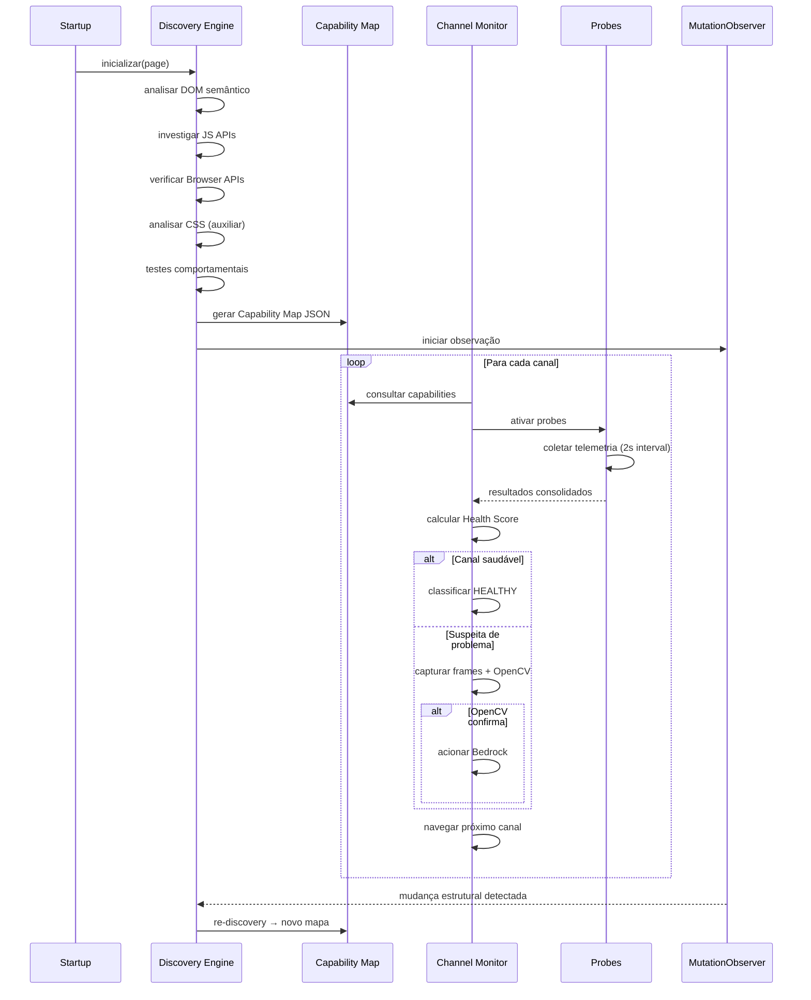

# Design Document — Player Discovery

## Overview

O sistema Player Discovery substitui a abordagem de seletores fixos (IDs, classes CSS, coordenadas) por um mecanismo de descoberta dinâmica e semântica das capacidades do player da plataforma SKY+. O design segue a filosofia "discovery uma vez, reutilização por todos os canais" — o mesmo player é compartilhado entre canais, então a análise completa executa apenas no startup.

### Decisões Arquiteturais Chave

1. **Discovery Engine como módulo independente**: Executa análise completa no startup e produz um Capability Map JSON reutilizável.
2. **Probes especializadas**: Cada dimensão de telemetria (vídeo, áudio, legendas, buffer, eventos) tem um módulo probe dedicado que consome o Capability Map.
3. **Três níveis de interação**: API do player (Nível 1) → DOM semântico (Nível 2) → Fallback visual (Nível 3).
4. **Detecção determinística primeiro**: OpenCV/Bedrock são acionados somente quando telemetria indica anomalia E a detecção determinística confirma.
5. **MutationObserver com debounce**: Monitora mudanças no DOM do player para invalidação inteligente do Capability Map.

### Relação com o Sistema Existente

O Player Discovery substitui as chamadas diretas a `document.querySelector('video')` presentes no `TelemetryCollector` atual por consultas ao Capability Map. O `PoCOrchestrator` será substituído pelo `ChannelMonitor` que orquestra a rotação multi-canal.

## Architecture

### Diagrama de Componentes



### Fluxo de Execução Principal



## Components and Interfaces

### 1. DiscoveryEngine

Responsável pela análise completa do player no startup.

```python
class DiscoveryEngine:
    """Motor de descoberta dinâmica de capabilities do player."""

    async def discover(self, page: Page) -> CapabilityMap:
        """Executa discovery completo e retorna Capability Map."""
        ...

    async def _analyze_dom(self, page: Page) -> list[DOMEvidence]:
        """Analisa DOM buscando role, aria-label, data-*, tabindex."""
        ...

    async def _analyze_js_apis(self, page: Page) -> list[JSEvidence]:
        """Investiga objetos globais e APIs do player."""
        ...

    async def _analyze_browser_apis(self, page: Page) -> list[BrowserAPIEvidence]:
        """Verifica disponibilidade de HTMLMediaElement, TextTrack, etc."""
        ...

    async def _analyze_css(self, page: Page) -> list[CSSEvidence]:
        """Coleta evidência auxiliar de CSS (display, visibility, etc.)."""
        ...

    async def _run_behavioral_test(
        self, page: Page, capability: str, evidence: list[Evidence]
    ) -> BehavioralTestResult:
        """Executa teste comportamental seguro para confirmar capability."""
        ...

    async def validate_map(self, page: Page, capability_map: CapabilityMap) -> bool:
        """Valida se o Capability Map atual ainda é válido."""
        ...

    async def rediscover(self, page: Page) -> CapabilityMap:
        """Re-executa discovery completo (após invalidação)."""
        ...
```

### 2. CapabilityMap

Estrutura central que descreve as capabilities do player.

```python
class CapabilityMap:
    """Mapa central de capabilities do player."""

    def get_capability(self, name: str) -> Capability:
        """Retorna capability pelo nome."""
        ...

    def get_interaction_strategy(self, capability: str) -> InteractionStrategy:
        """Retorna a estratégia de interação preferencial."""
        ...

    def is_valid(self) -> bool:
        """Verifica se o mapa está válido (não invalidado)."""
        ...

    def invalidate(self) -> None:
        """Marca o mapa como inválido."""
        ...

    def to_json(self) -> str:
        """Serializa o mapa para JSON."""
        ...

    @classmethod
    def from_json(cls, json_str: str) -> "CapabilityMap":
        """Deserializa o mapa a partir de JSON."""
        ...
```

### 3. InteractionManager

Gerencia a hierarquia de interação com o player.

```python
class InteractionManager:
    """Gerencia interações com o player via três níveis."""

    async def execute(
        self, page: Page, capability: str, action: str, capability_map: CapabilityMap
    ) -> InteractionResult:
        """Executa interação seguindo hierarquia: API → DOM → Visual."""
        ...

    async def _execute_api(self, page: Page, strategy: APIStrategy) -> InteractionResult:
        """Nível 1: Chamada direta à API do player."""
        ...

    async def _execute_semantic_dom(
        self, page: Page, strategy: SemanticDOMStrategy
    ) -> InteractionResult:
        """Nível 2: Locator via role, aria-label, text."""
        ...

    async def _execute_visual_fallback(
        self, page: Page, strategy: VisualFallbackStrategy
    ) -> InteractionResult:
        """Nível 3: Interação visual sem coordenadas fixas."""
        ...
```

### 4. MutationObserverWatcher

Monitora mudanças no DOM para detectar invalidação.

```python
class MutationObserverWatcher:
    """Observa mudanças no DOM do player com debounce."""

    async def start(self, page: Page, capability_map: CapabilityMap) -> None:
        """Inicia observação do DOM com MutationObserver."""
        ...

    async def stop(self) -> None:
        """Para a observação."""
        ...

    def on_structural_change(self, callback: Callable) -> None:
        """Registra callback para mudanças estruturais."""
        ...
```

### 5. Probes

```python
class VideoProbe:
    """Coleta telemetria de vídeo usando o Capability Map."""

    async def collect(self, page: Page, capability_map: CapabilityMap) -> VideoTelemetry:
        ...

class AudioProbe:
    """Coleta telemetria e testa funcionalidade de áudio."""

    async def collect(self, page: Page, capability_map: CapabilityMap) -> AudioTelemetry:
        ...
    async def run_functional_test(self, page: Page, capability_map: CapabilityMap) -> FunctionalTestResult:
        ...

class SubtitleProbe:
    """Coleta telemetria e testa funcionalidade de legendas."""

    async def collect(self, page: Page, capability_map: CapabilityMap) -> SubtitleTelemetry:
        ...
    async def run_functional_test(self, page: Page, capability_map: CapabilityMap) -> FunctionalTestResult:
        ...

class BufferProbe:
    """Coleta telemetria detalhada de buffer."""

    async def collect(self, page: Page, capability_map: CapabilityMap) -> BufferTelemetry:
        ...

class EventProbe:
    """Registra todos os eventos do HTMLMediaElement."""

    async def attach_listeners(self, page: Page) -> None:
        ...
    async def get_events(self, page: Page) -> list[PlayerEvent]:
        ...
    async def clear_events(self) -> None:
        ...
```

### 6. ChannelMonitor

Orquestrador principal de rotação multi-canal.

```python
class ChannelMonitor:
    """Orquestra rotação de canais usando o Capability Map."""

    async def start_rotation(self, channels: list[str]) -> None:
        """Inicia rotação pela lista de canais."""
        ...

    async def monitor_channel(self, channel_url: str) -> ChannelReport:
        """Monitora um canal individual durante o período de observação."""
        ...

    async def run_functional_tests(self, channel_url: str) -> list[FunctionalTestResult]:
        """Executa testes funcionais no canal (a cada N rotações)."""
        ...
```

### 7. HealthScoreCalculator

```python
class HealthScoreCalculator:
    """Calcula Health Scores compostos."""

    def calculate_video_health(self, telemetry: VideoTelemetry) -> float:
        """Calcula Video Health Score (0-100)."""
        ...

    def calculate_audio_health(self, telemetry: AudioTelemetry) -> float:
        """Calcula Audio Health Score (0-100)."""
        ...

    def calculate_functional_health(self, results: list[FunctionalTestResult]) -> float:
        """Calcula Functional Health Score (0-100)."""
        ...
```

## Data Models

### Capability Map JSON Schema

```json
{
  "player_info": {
    "library": "string | null",
    "version": "string | null",
    "video_elements": ["selector_description"],
    "discovered_at": "ISO 8601 timestamp"
  },
  "capabilities": {
    "play": {
      "available": true,
      "confidence": 0.95,
      "evidence": ["aria-label='Play' encontrado", "player.play() disponível"],
      "interaction_strategy": "player_api",
      "strategies": [
        {"level": 1, "type": "player_api", "details": {"method": "player.play()"}},
        {"level": 2, "type": "semantic_dom", "details": {"role": "button", "aria_label": "Play"}},
        {"level": 3, "type": "visual_fallback", "details": {"description": "botão play no centro"}}
      ]
    },
    "pause": { "..." },
    "mute": { "..." },
    "unmute": { "..." },
    "audio_selection": { "..." },
    "subtitle_selection": { "..." },
    "quality_selection": { "..." },
    "fullscreen": { "..." },
    "settings": { "..." }
  },
  "metadata": {
    "discovery_duration_ms": 45000,
    "total_capabilities": 9,
    "available_count": 7,
    "unavailable_count": 2,
    "version_hash": "sha256 do DOM structure"
  }
}
```

### Dataclasses Python

```python
from dataclasses import dataclass, field
from enum import Enum
from typing import Optional


class InteractionLevel(Enum):
    """Nível de interação com o player."""
    PLAYER_API = "player_api"        # Nível 1
    SEMANTIC_DOM = "semantic_dom"     # Nível 2
    VISUAL_FALLBACK = "visual_fallback"  # Nível 3


class CapabilityStatus(Enum):
    """Status de disponibilidade de uma capability."""
    AVAILABLE = "available"
    UNAVAILABLE = "unavailable"
    UNKNOWN = "unknown"


class ChannelHealthStatus(Enum):
    """Status de saúde de um canal."""
    HEALTHY = "HEALTHY"
    SUSPECT = "SUSPECT"
    DEGRADED = "DEGRADED"
    CRITICAL = "CRITICAL"


class FunctionalTestStatus(Enum):
    """Resultado de um teste funcional."""
    PASS = "PASS"
    FAIL = "FAIL"
    SKIPPED = "SKIPPED"


class AudioStatus(Enum):
    """Estado de áudio."""
    OK = "OK"
    NO_AUDIO = "NO_AUDIO"
    AUDIO_LOW = "AUDIO_LOW"


class BufferStatus(Enum):
    """Estado de buffer."""
    OK = "OK"
    BUFFER_LOW = "BUFFER_LOW"
    BUFFERING_FREQUENT = "BUFFERING_FREQUENT"


@dataclass
class InteractionStrategy:
    """Estratégia de interação para uma capability."""
    level: InteractionLevel
    type: str
    details: dict = field(default_factory=dict)


@dataclass
class Capability:
    """Uma capability descoberta do player."""
    name: str
    available: bool
    confidence: float  # 0.0 a 1.0
    evidence: list[str] = field(default_factory=list)
    interaction_strategy: InteractionLevel = InteractionLevel.SEMANTIC_DOM
    strategies: list[InteractionStrategy] = field(default_factory=list)


@dataclass
class PlayerInfo:
    """Informações gerais do player."""
    library: Optional[str] = None
    version: Optional[str] = None
    video_elements: list[str] = field(default_factory=list)
    discovered_at: str = ""


@dataclass
class CapabilityMapData:
    """Dados internos do Capability Map."""
    player_info: PlayerInfo
    capabilities: dict[str, Capability] = field(default_factory=dict)
    discovery_duration_ms: int = 0
    version_hash: str = ""
    valid: bool = True


@dataclass
class VideoTelemetry:
    """Telemetria completa de vídeo por canal."""
    current_time: float
    duration: float
    ready_state: int
    paused: bool
    playing: bool
    ended: bool
    seeking: bool
    playback_rate: float
    network_state: int
    buffered_seconds: float
    video_width: int
    video_height: int
    error: Optional[str] = None
    total_frames: Optional[int] = None
    dropped_frames: Optional[int] = None
    drop_rate: Optional[float] = None
    fps_avg: Optional[float] = None
    fps_min: Optional[float] = None
    fps_max: Optional[float] = None
    quality_changes: int = 0
    up_switches: int = 0
    down_switches: int = 0


@dataclass
class AudioTelemetry:
    """Telemetria completa de áudio por canal."""
    rms: Optional[float] = None
    peak: Optional[float] = None
    silence_duration: float = 0.0
    muted: bool = False
    status: AudioStatus = AudioStatus.OK
    tracks_available: list[str] = field(default_factory=list)


@dataclass
class SubtitleTelemetry:
    """Telemetria completa de legendas por canal."""
    tracks_available: int = 0
    tracks: list[dict] = field(default_factory=list)  # language, label, kind, mode
    active_track: Optional[str] = None
    has_active_cues: bool = False
    status: str = "OK"


@dataclass
class BufferTelemetry:
    """Telemetria detalhada de buffer."""
    buffered_start: float = 0.0
    buffered_end: float = 0.0
    buffer_ahead: float = 0.0
    waiting_count: int = 0
    waiting_total_ms: float = 0.0
    longest_wait_ms: float = 0.0
    time_since_last_wait: Optional[float] = None
    status: BufferStatus = BufferStatus.OK


@dataclass
class PlayerEvent:
    """Evento do HTMLMediaElement registrado."""
    event_type: str
    timestamp: str  # ISO 8601
    current_time: float
    additional_data: dict = field(default_factory=dict)


@dataclass
class InteractionResult:
    """Resultado de uma interação com o player."""
    success: bool
    level_used: InteractionLevel
    duration_ms: int
    error: Optional[str] = None


@dataclass
class FunctionalTestResult:
    """Resultado de um teste funcional."""
    capability: str
    status: FunctionalTestStatus
    action_executed: str
    expected_result: str
    actual_result: str
    duration_ms: int
    error: Optional[str] = None


@dataclass
class HealthScores:
    """Scores de saúde compostos."""
    video_health: float = 0.0   # 0-100
    audio_health: float = 0.0   # 0-100
    functional_health: float = 0.0  # 0-100


@dataclass
class ChannelReport:
    """Relatório consolidado de um canal."""
    channel_id: str
    channel_url: str
    status: ChannelHealthStatus
    health_scores: HealthScores
    video_telemetry: VideoTelemetry
    audio_telemetry: AudioTelemetry
    subtitle_telemetry: SubtitleTelemetry
    buffer_telemetry: BufferTelemetry
    events: list[PlayerEvent] = field(default_factory=list)
    functional_tests: list[FunctionalTestResult] = field(default_factory=list)
    observation_duration_ms: int = 0
    escalated_to_opencv: bool = False
    escalated_to_bedrock: bool = False
```

## Correctness Properties

*Uma propriedade é uma característica ou comportamento que deve ser verdadeiro em todas as execuções válidas de um sistema — essencialmente, uma declaração formal sobre o que o sistema deve fazer. Propriedades servem como ponte entre especificações legíveis por humanos e garantias de correção verificáveis por máquina.*

### Property 1: Serialização round-trip do Capability Map

*Para qualquer* Capability Map válido, serializar para JSON e deserializar de volta deve produzir um objeto equivalente ao original.

**Validates: Requirements 2.5**

### Property 2: Classificação de confidence é determinística

*Para qualquer* capability com um confidence score, se confidence >= 0.7 então available deve ser true e interaction_strategy deve seguir a hierarquia (player_api > semantic_dom > visual_fallback); se confidence < 0.7 então available deve ser false.

**Validates: Requirements 2.2, 2.3**

### Property 3: Capability Map contém estrutura mínima obrigatória

*Para qualquer* Capability Map produzido pelo Discovery Engine, o mapa deve conter player_info (library, version, video_elements) e capabilities para no mínimo: play, pause, mute, unmute, audio_selection, subtitle_selection, quality_selection, fullscreen e settings, cada uma com campos available, confidence, evidence e interaction_strategy.

**Validates: Requirements 1.7, 2.1**

### Property 4: CSS isolado nunca produz alta confidence

*Para qualquer* capability onde a única evidência é de natureza CSS (display, visibility, opacity, pointer-events), a confidence resultante deve ser inferior a 0.7 (ou seja, CSS isolado nunca classifica uma capability como available).

**Validates: Requirements 1.5**

### Property 5: Idempotência do cache — discovery válido rejeita re-execução

*Para qualquer* estado onde o Capability Map está marcado como válido, chamadas subsequentes ao Discovery Engine devem retornar o mesmo mapa sem re-executar a análise completa.

**Validates: Requirements 3.2**

### Property 6: Debounce de mutações agrupa dentro da janela

*Para qualquer* sequência de mutações DOM com timestamps dentro da janela de debounce configurada, o MutationObserver Watcher deve agrupá-las em um único evento de avaliação (e não disparar múltiplas avaliações).

**Validates: Requirements 4.1**

### Property 7: Classificação de mudanças — estrutural vs cosmética

*Para qualquer* mutação DOM, se a mudança é classificada como cosmética (texto de conteúdo, estilos não-estruturais) o Capability Map não deve ser invalidado; se a mudança é estrutural (criação/remoção de controles, mudanças de atributos semânticos) deve disparar validação.

**Validates: Requirements 4.3, 4.4**

### Property 8: Classificação de freeze por stalled currentTime

*Para qualquer* sequência de amostras de telemetria onde currentTime não avança por mais de 5 segundos consecutivos com paused=false, o VideoProbe deve classificar como possível freeze.

**Validates: Requirements 5.5**

### Property 9: Cálculo de drop_rate é correto

*Para quaisquer* valores de totalVideoFrames > 0 e droppedVideoFrames, o drop_rate calculado deve ser exatamente droppedVideoFrames / totalVideoFrames, e deve estar no range [0.0, 1.0].

**Validates: Requirements 5.2**

### Property 10: Classificação de status de áudio por RMS

*Para qualquer* sequência de amostras de áudio ao longo do tempo com muted=false: se RMS < 0.01 por mais de 10 segundos consecutivos o status deve ser NO_AUDIO; se RMS entre 0.01 e 0.05 por mais de 10 segundos consecutivos o status deve ser AUDIO_LOW; caso contrário, OK.

**Validates: Requirements 6.2, 6.3**

### Property 11: Classificação de status de buffer

*Para qualquer* estado de buffer: se buffer_ahead < 2 segundos com player em estado playing, o status deve ser BUFFER_LOW; se mais de 3 eventos waiting ocorrem em janela de 60 segundos, o status deve ser BUFFERING_FREQUENT.

**Validates: Requirements 8.3, 8.4**

### Property 12: Cálculo de métricas de waiting events

*Para qualquer* sequência de eventos waiting com timestamps, waiting_count deve ser o número total de eventos, waiting_total_ms deve ser a soma das durações, e longest_wait_ms deve ser a maior duração individual.

**Validates: Requirements 8.2**

### Property 13: Retenção de eventos na janela de 5 minutos

*Para qualquer* lista de eventos com timestamps variados, após aplicar a janela de retenção, somente eventos com timestamp nos últimos 5 minutos devem permanecer, e eventos mais antigos devem ser removidos.

**Validates: Requirements 9.4**

### Property 14: Registro de eventos contém campos obrigatórios

*Para qualquer* evento capturado do HTMLMediaElement, o registro deve conter event_type (string não-vazia), timestamp em formato ISO 8601 com milissegundos, e currentTime no momento do evento.

**Validates: Requirements 9.2**

### Property 15: Invalidação do Capability Map por threshold de falhas consecutivas

*Para qualquer* sequência de resultados por canal (sucesso/falha), o Capability Map deve ser invalidado somente quando o número de falhas em canais consecutivos atinge o threshold configurado (padrão: 3). Falhas em canais não-consecutivos não devem acumular.

**Validates: Requirements 10.4**

### Property 16: Frequência de testes funcionais segue configuração

*Para qualquer* número de rotações completas e intervalo N configurado, testes funcionais devem executar exatamente nas rotações que são múltiplas de N (rotação N, 2N, 3N, ...).

**Validates: Requirements 11.1**

### Property 17: Ordenação de testes funcionais por impacto

*Para qualquer* conjunto de capabilities disponíveis para teste funcional, a ordem de execução deve ser: play/pause → mute/unmute → audio_selection → subtitle_selection (menor impacto para maior impacto).

**Validates: Requirements 11.2**

### Property 18: Sinalização de validação quando capability de alta confidence falha

*Para qualquer* capability com confidence >= 0.9 que falha em um teste funcional, o sistema deve sinalizar necessidade de validação do Capability Map.

**Validates: Requirements 11.4**

### Property 19: Hierarquia de interação — strategies ordenadas e fallback correto

*Para qualquer* capability no Capability Map, as strategies disponíveis devem estar ordenadas por nível (1: player_api, 2: semantic_dom, 3: visual_fallback), e durante execução, o fallback deve seguir estritamente a ordem: tentar Nível 1 → se falhar, Nível 2 → se falhar, Nível 3.

**Validates: Requirements 12.1, 12.2, 12.3**

### Property 20: Rejeição de coordenadas fixas e índices posicionais

*Para qualquer* tentativa de interação com o player, strategies baseadas em coordenadas absolutas (x, y fixos), posição fixa ou índice posicional de elementos (primeiro botão, segundo item) devem ser rejeitadas.

**Validates: Requirements 12.4**

### Property 21: Health Scores são bounded e seguem pesos definidos

*Para qualquer* conjunto de métricas de telemetria: Video Health Score deve estar em [0, 100] com pesos (Playback 20%, Buffer 15%, Dropped Frames 15%, Freeze 10%, FPS 10%, Resolution 10%, DRM 20%); Audio Health Score em [0, 100] com pesos (Audio present 40%, RMS 20%, Peak 10%, Silence 20%, Track 10%); Functional Health Score em [0, 100] com pesos iguais de 25% por capability.

**Validates: Requirements 13.1, 13.2, 13.3**

### Property 22: Pipeline de escalação determinística

*Para qualquer* estado de telemetria de um canal: se saudável (currentTime avançando, buffer adequado, áudio presente, sem erros) então classificar como HEALTHY sem capturar frames adicionais nem acionar OpenCV/Bedrock; se suspeito então capturar frames e acionar OpenCV; se OpenCV não confirma anomalia, não acionar Bedrock.

**Validates: Requirements 14.1, 14.2, 14.4**

### Property 23: Canal HEALTHY limita captura a 1 frame por ciclo

*Para qualquer* canal classificado como HEALTHY, a captura de frames deve ser limitada a exatamente 1 frame de validação por ciclo de observação.

**Validates: Requirements 14.5**

## Error Handling

### Estratégia Geral

O sistema adota uma abordagem de **degradação graciosa** — falhas em componentes individuais não devem impedir o monitoramento contínuo.

### Falhas no Discovery Engine

| Cenário | Comportamento |
|---------|--------------|
| Timeout no discovery (> 60s) | Log ERROR, retry com backoff exponencial (max 3 tentativas) |
| DOM vazio ou player não encontrado | Log ERROR, aguardar carregamento com polling (max 30s) |
| Teste comportamental falha | Classificar capability como UNKNOWN (confidence < 0.7), continuar discovery |
| Exceção inesperada na análise JS | Capturar exceção, registrar evidence parcial, continuar |

### Falhas nas Probes

| Cenário | Comportamento |
|---------|--------------|
| page.evaluate() falha (crash de tab) | Log ERROR, retry 1x, se falhar novamente marcar canal como DEGRADED |
| Web Audio API indisponível | AudioProbe retorna status UNAVAILABLE, não falha |
| TextTrack API indisponível | SubtitleProbe retorna SUBTITLE_UNAVAILABLE, skip testes |
| Timeout na coleta de telemetria | Retornar amostras coletadas até o momento |

### Falhas na Interação

| Cenário | Comportamento |
|---------|--------------|
| Nível 1 (API) falha | Tentar Nível 2 (DOM semântico) |
| Nível 2 (DOM) falha | Tentar Nível 3 (Visual fallback) |
| Todos os níveis falham | Registrar FUNCTIONAL_FAIL, acumular evidência de invalidação |
| Element not found | Tentar fallback, não usar coordenadas fixas |

### Falhas na Rotação de Canais

| Cenário | Comportamento |
|---------|--------------|
| Canal individual falha | Log WARNING, registrar no relatório, prosseguir para próximo canal |
| Navigation timeout | Retry 1x com timeout maior, se falhar registrar FAIL e prosseguir |
| N canais consecutivos falham | Verificar se é problema do canal ou do Capability Map |
| Capability Map invalidado durante rotação | Pausar rotação, executar re-discovery, retomar |

### Limites de Retry

- Discovery Engine: max 3 retries com backoff (2s, 4s, 8s)
- Probes (coleta): max 1 retry imediato
- Interações: fallback automático pelos 3 níveis (sem retry no mesmo nível)
- Navegação de canal: max 1 retry com timeout 2x

## Testing Strategy

### Abordagem Dual: Unit Tests + Property-Based Tests

O projeto utiliza **Hypothesis** (já configurado em `requirements.txt`) como framework de property-based testing, complementado por pytest para testes de exemplo e integração.

### Property-Based Tests (PBT)

Cada propriedade definida na seção Correctness Properties será implementada como um teste Hypothesis com mínimo de 100 iterações.

**Configuração:**
```python
from hypothesis import given, settings, strategies as st

@settings(max_examples=100)
@given(...)
def test_property_N_description(self, ...):
    # Feature: player-discovery, Property N: <descrição>
    ...
```

**Tag format:** `Feature: player-discovery, Property {number}: {property_text}`

**Propriedades a implementar como PBT:**
1. Serialização round-trip do Capability Map
2. Classificação de confidence determinística
3. Estrutura mínima obrigatória do Capability Map
4. CSS isolado nunca produz alta confidence
5. Idempotência do cache
6. Debounce de mutações
7. Classificação estrutural vs cosmética
8. Classificação de freeze
9. Cálculo de drop_rate
10. Classificação de áudio por RMS
11. Classificação de buffer
12. Cálculo de métricas de waiting
13. Retenção de eventos (janela 5 min)
14. Campos obrigatórios de eventos
15. Threshold de invalidação
16. Frequência de testes funcionais
17. Ordenação por impacto
18. Sinalização de alta confidence
19. Hierarquia de interação e fallback
20. Rejeição de coordenadas fixas
21. Health Scores bounded e ponderados
22. Pipeline de escalação determinística
23. Captura limitada a 1 frame (HEALTHY)

### Unit Tests (Exemplos)

Testes de exemplo para cenários específicos e edge cases:

- Discovery com DOM completamente vazio
- Discovery com player não-padrão (sem APIs conhecidas)
- Navegação para canal que retorna 404
- Timeout de carregamento do player
- MutationObserver com mudança de idioma (cosmética)
- Functional test com player em fullscreen
- Canal com 0 tracks de legenda (SUBTITLE_UNAVAILABLE)
- Re-discovery após invalidação

### Integration Tests

Testes com mocks de Playwright Page:

- Fluxo completo discovery → capabilities → rotação de 3 canais
- Re-discovery acionado por MutationObserver
- Escalação completa: telemetria suspeita → OpenCV → Bedrock
- Functional tests executando play/pause + mute/unmute reais (mock)

### Test Organization

```
tests/
├── test_prop_capability_map.py          # Properties 1, 2, 3, 4
├── test_prop_discovery_cache.py         # Property 5
├── test_prop_mutation_observer.py       # Properties 6, 7
├── test_prop_video_probe.py             # Properties 8, 9
├── test_prop_audio_probe.py             # Property 10
├── test_prop_buffer_probe.py            # Properties 11, 12
├── test_prop_event_probe.py             # Properties 13, 14
├── test_prop_channel_monitor.py         # Properties 15, 16, 17, 18
├── test_prop_interaction_manager.py     # Properties 19, 20
├── test_prop_health_score.py            # Property 21
├── test_prop_escalation_pipeline.py     # Properties 22, 23
├── test_discovery_engine.py             # Unit tests
├── test_channel_monitor.py              # Unit tests
├── test_interaction_manager.py          # Unit tests
└── test_integration_discovery.py        # Integration tests
```

