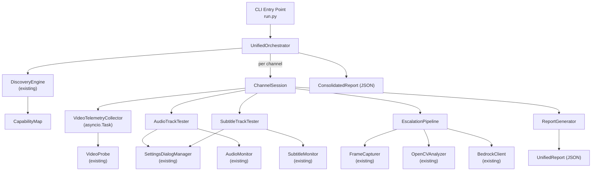
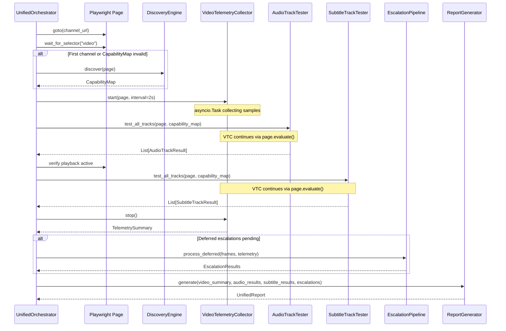

# Design Document: Unified Channel Monitor

## Overview

O Unified Channel Monitor consolida os módulos `player_discovery` (monitoramento contínuo de vídeo) e `audio_subtitle_monitor` (testes de tracks de áudio/legendas) em um único orquestrador. O módulo reutiliza componentes existentes — `DiscoveryEngine`, `VideoProbe`, `AudioMonitor`, `SubtitleMonitor`, `SettingsDialogManager`, `FrameCapturer`, `OpenCVAnalyzer` e `BedrockClient` — coordenando-os dentro de uma nova camada de orquestração que adiciona:

- **Coleta de telemetria de vídeo em background** via asyncio Task durante testes de tracks
- **Pipeline de escalação deferida** que respeita interações de UI em andamento
- **Relatório unificado por canal** combinando saúde de vídeo + resultados de áudio + resultados de legendas
- **Shutdown graceful** com persistência de resultados parciais
- **Configuração unificada** via env vars com prefixo `UNIFIED_MONITOR_`

A arquitetura mantém o padrão "single Playwright Page" do projeto, operação sequencial por canal, e adiciona coordenação temporal entre coleta passiva (JS evaluation) e interações ativas (DOM clicks via Settings Dialog).

## Architecture

### Diagrama de Alto Nível



### Princípios Arquiteturais

1. **Composição sobre herança**: O `UnifiedOrchestrator` compõe os componentes existentes sem subclassificá-los
2. **Single Page compartilhada**: Todos os componentes recebem a mesma instância `Page` do Playwright
3. **Separação de acesso ao DOM**: `VideoTelemetryCollector` usa apenas `page.evaluate()` (JS puro) enquanto `AudioTrackTester`/`SubtitleTrackTester` podem interagir com DOM via cliques
4. **Escalação deferida**: Anomalias detectadas durante testes de tracks são enfileiradas e processadas após o teste atual completar
5. **Fail-forward**: Falhas em um canal não interrompem a rotação — o erro é registrado e o próximo canal é processado

### Fluxo de Execução por Channel Session



## Components and Interfaces

### 1. UnifiedOrchestrator (`src/unified_channel_monitor/orchestrator.py`)

Componente principal que coordena todo o ciclo de vida.

```python
class UnifiedOrchestrator:
    """Orquestrador unificado de monitoramento de canais."""
    
    def __init__(
        self,
        page: Page,
        config: UnifiedMonitorConfig,
        frame_capturer: Optional[FrameCapturer] = None,
        opencv_analyzer: Optional[OpenCVAnalyzer] = None,
        bedrock_client: Optional[BedrockClient] = None,
    ) -> None: ...
    
    async def run_single_rotation(self, channels: list[str]) -> ConsolidatedReport:
        """Executa uma única rotação por todos os canais."""
        ...
    
    async def run_continuous(self, channels: list[str]) -> None:
        """Executa rotações em loop até shutdown."""
        ...
    
    async def shutdown(self) -> None:
        """Shutdown graceful: completa operação atual, salva parciais."""
        ...
```

### 2. VideoTelemetryCollector (`src/unified_channel_monitor/video_telemetry.py`)

Coleta telemetria de vídeo em background via asyncio Task.

```python
class VideoTelemetryCollector:
    """Coleta contínua de telemetria de vídeo em background."""
    
    async def start(self, page: Page, interval_s: float = 2.0) -> None:
        """Inicia coleta em asyncio.Task."""
        ...
    
    async def stop(self) -> TelemetrySummary:
        """Para coleta e retorna sumário."""
        ...
    
    def annotate_current_sample(self, context: dict) -> None:
        """Anota a amostra atual com contexto de track switch."""
        ...
    
    def get_deferred_escalations(self) -> list[DeferredEscalation]:
        """Retorna escalações pendentes detectadas durante testes."""
        ...
    
    @property
    def is_running(self) -> bool: ...
    
    @property
    def samples(self) -> list[TelemetrySample]: ...
```

### 3. AudioTrackTester (`src/unified_channel_monitor/audio_tester.py`)

Wrapper sobre `AudioMonitor` e `SettingsDialogManager` existentes, adicionando integração com `VideoTelemetryCollector` para anotações.

```python
class AudioTrackTester:
    """Testa todos os audio tracks durante uma Channel Session."""
    
    def __init__(
        self,
        page: Page,
        capability_map: CapabilityMap,
        config: UnifiedMonitorConfig,
        telemetry_collector: VideoTelemetryCollector,
    ) -> None: ...
    
    async def test_all_tracks(self) -> list[AudioTrackResult]:
        """Descobre e testa todos os audio tracks."""
        ...
```

### 4. SubtitleTrackTester (`src/unified_channel_monitor/subtitle_tester.py`)

Wrapper sobre `SubtitleMonitor` e `SettingsDialogManager`, com integração de anotações.

```python
class SubtitleTrackTester:
    """Testa todos os subtitle tracks durante uma Channel Session."""
    
    def __init__(
        self,
        page: Page,
        capability_map: CapabilityMap,
        config: UnifiedMonitorConfig,
        telemetry_collector: VideoTelemetryCollector,
    ) -> None: ...
    
    async def test_all_tracks(self) -> list[SubtitleTrackResult]:
        """Descobre e testa todos os subtitle tracks."""
        ...
```

### 5. EscalationManager (`src/unified_channel_monitor/escalation.py`)

Gerencia a pipeline de escalação com suporte a deferimento.

```python
class EscalationManager:
    """Gerencia escalação HEALTHY → SUSPECT → OpenCV → Bedrock."""
    
    def __init__(
        self,
        page: Page,
        frame_capturer: Optional[FrameCapturer],
        opencv_analyzer: Optional[OpenCVAnalyzer],
        bedrock_client: Optional[BedrockClient],
    ) -> None: ...
    
    def defer_escalation(self, trigger: EscalationTrigger) -> None:
        """Enfileira escalação para processamento posterior."""
        ...
    
    async def process_deferred(self) -> list[EscalationResult]:
        """Processa todas as escalações deferidas."""
        ...
    
    async def escalate_immediate(self, trigger: EscalationTrigger) -> EscalationResult:
        """Executa escalação imediata (quando não há testes de track ativos)."""
        ...
```

### 6. UnifiedMonitorConfig (`src/unified_channel_monitor/config.py`)

Configuração centralizada com env vars prefix `UNIFIED_MONITOR_`.

```python
@dataclass
class UnifiedMonitorConfig:
    """Configuração unificada — combina parâmetros de ambos os módulos."""
    
    # Canais
    channels: list[str] = field(default_factory=list)
    
    # Video Telemetry
    telemetry_interval_s: float = 2.0
    observation_period_s: float = 30.0
    freeze_consecutive_samples: int = 3
    
    # Audio Testing
    audio_telemetry_window_s: float = 30.0
    audio_sample_interval_s: float = 2.0
    audio_pass_threshold: float = 0.80
    audio_rms_threshold: float = 0.01
    
    # Subtitle Testing
    subtitle_cue_timeout_s: float = 15.0
    subtitle_poll_interval_s: float = 0.5
    
    # Track Switch
    track_switch_timeout_s: float = 5.0
    
    # Discovery
    invalidation_threshold: int = 3
    
    # Output
    output_dir: str = "reports/"
    log_level: str = "INFO"
    
    # Browser
    chrome_profile_dir: str = ""
    playback_wait_timeout_s: float = 30.0
    
    # Continuous mode
    continuous: bool = False
    
    @classmethod
    def from_env(cls) -> UnifiedMonitorConfig: ...
```

### 7. ReportGenerator (`src/unified_channel_monitor/report_generator.py`)

Gera relatórios unificados e consolidados em JSON.

```python
class UnifiedReportGenerator:
    """Gera UnifiedReport por canal e ConsolidatedReport por rotação."""
    
    def create_channel_report(
        self,
        channel_url: str,
        video_summary: TelemetrySummary,
        audio_results: list[AudioTrackResult],
        subtitle_results: list[SubtitleTrackResult],
        escalation_results: list[EscalationResult],
        duration_ms: int,
    ) -> UnifiedChannelReport: ...
    
    def create_consolidated_report(
        self,
        channel_reports: list[UnifiedChannelReport],
    ) -> ConsolidatedReport: ...
    
    def persist_report(self, report: dict, filename: str) -> Path: ...
```

### 8. CLI Entry Point (`src/unified_channel_monitor/run.py`)

```python
"""Entry point: PYTHONPATH=. python -m src.unified_channel_monitor.run"""

async def main() -> None:
    config = UnifiedMonitorConfig.from_env()
    # Parse --continuous flag from sys.argv
    # Launch Playwright persistent context
    # Create UnifiedOrchestrator
    # Register SIGINT handler
    # Run single or continuous rotation
    ...
```

## Data Models

### TelemetrySample

```python
@dataclass
class TelemetrySample:
    """Uma amostra individual de telemetria de vídeo."""
    timestamp: str                    # ISO 8601
    current_time: float               # video.currentTime
    total_frames_decoded: int         # totalVideoFrames
    frames_dropped: int               # droppedVideoFrames
    estimated_fps: float | None       # calculado entre amostras
    buffer_ahead_s: float             # buffered_seconds
    ready_state: int                  # video.readyState
    is_freeze: bool                   # flag de freeze detectado
    annotation: dict | None = None    # contexto de track switch, se aplicável
```

### TelemetrySummary

```python
@dataclass
class TelemetrySummary:
    """Resumo da coleta de telemetria de uma Channel Session."""
    total_samples: int
    freeze_events: list[FreezeEvent]
    average_buffer_ahead_s: float
    average_fps: float | None
    health_classification: str        # HEALTHY | SUSPECT | DEGRADED | CRITICAL
    annotations: list[dict]           # amostras anotadas com contexto de switch
    start_time: str                   # ISO 8601
    end_time: str                     # ISO 8601
    duration_s: float
```

### FreezeEvent

```python
@dataclass
class FreezeEvent:
    """Evento de freeze detectado na telemetria."""
    timestamp: str                    # ISO 8601 do início do freeze
    duration_samples: int             # número de amostras com freeze
    current_time_stalled: float       # valor de currentTime parado
    annotation: dict | None = None    # contexto concorrente (track switch?)
```

### DeferredEscalation

```python
@dataclass
class DeferredEscalation:
    """Escalação deferida durante teste de tracks."""
    trigger_timestamp: str
    health_classification: str
    telemetry_sample: TelemetrySample
    track_switch_context: dict | None
```

### EscalationResult

```python
@dataclass
class EscalationResult:
    """Resultado de uma escalação processada."""
    trigger_timestamp: str
    opencv_verdict: str | None        # "black_screen" | "freeze" | "normal" | None
    bedrock_diagnosis: str | None     # diagnóstico textual ou None
    frames_analyzed: int
    deferred: bool                    # se foi deferida durante track test
```

### AudioTrackResult

```python
@dataclass
class AudioTrackResult:
    """Resultado do teste de um audio track."""
    track_name: str
    status: str                       # PASS | FAIL | SKIP
    fail_reason: str | None           # "switch_timeout" | None
    rms_avg: float | None
    audio_present_ratio: float | None
    switch_validated: bool
    duration_ms: int
```

### SubtitleTrackResult

```python
@dataclass
class SubtitleTrackResult:
    """Resultado do teste de um subtitle track."""
    track_name: str
    status: str                       # PASS | FAIL | SKIP
    fail_reason: str | None           # "switch_timeout" | "no_cue_received" | "dialog_unavailable"
    cue_received: bool
    time_to_first_cue_ms: int | None
    switch_validated: bool
    duration_ms: int
```

### UnifiedChannelReport

```python
@dataclass
class UnifiedChannelReport:
    """Relatório unificado por canal."""
    channel_url: str
    channel_id: str
    session_id: str                   # UUID para correlação de logs
    timestamp: str                    # ISO 8601
    status: str                       # PASS | PARTIAL | FAIL | UNREACHABLE | ERROR
    duration_ms: int
    
    # Video
    video_summary: TelemetrySummary
    
    # Audio
    audio_tracks_tested: int
    audio_tracks_passed: int
    audio_results: list[AudioTrackResult]
    
    # Subtitles
    subtitle_tracks_tested: int
    subtitle_tracks_passed: int
    subtitle_results: list[SubtitleTrackResult]
    
    # Escalation
    escalation_results: list[EscalationResult]
    
    # Annotations (correlação entre freeze/buffer e track switches)
    telemetry_annotations: list[dict]
    
    errors: list[str]
```

### ConsolidatedReport

```python
@dataclass
class ConsolidatedReport:
    """Relatório consolidado de uma rotação completa."""
    timestamp: str
    total_channels: int
    channels_pass: int
    channels_partial: int
    channels_fail: int
    channels_unreachable: int
    channels_error: int
    total_duration_ms: int
    channel_reports: list[UnifiedChannelReport]
    is_partial: bool = False          # True se shutdown interrompeu
```

### ChannelSessionStatus (Enum)

```python
class ChannelSessionStatus(str, Enum):
    """Status possíveis de uma Channel Session."""
    PASS = "PASS"
    PARTIAL = "PARTIAL"
    FAIL = "FAIL"
    UNREACHABLE = "UNREACHABLE"
    ERROR = "ERROR"
```


## Correctness Properties

*A property is a characteristic or behavior that should hold true across all valid executions of a system — essentially, a formal statement about what the system should do. Properties serve as the bridge between human-readable specifications and machine-verifiable correctness guarantees.*

### Property 1: Configuration parsing round-trip

*For any* comma-separated string of URLs (with arbitrary whitespace, empty entries, and valid URL characters), parsing via `UnifiedMonitorConfig.from_env()` SHALL produce a list where each non-empty entry is present, trimmed, and in the original order.

**Validates: Requirements 1.4, 10.1, 10.3**

### Property 2: Configuration robustness against invalid values

*For any* environment variable that expects a numeric value (int or float), if the value is set to a non-numeric string, `UnifiedMonitorConfig.from_env()` SHALL return the default value for that field and the original default SHALL be preserved unchanged.

**Validates: Requirements 10.4**

### Property 3: Sequential processing with error resilience

*For any* list of N channels where some channels fail (timeout or exception), the Unified_Orchestrator SHALL produce a ConsolidatedReport with exactly N entries, where failed channels have status UNREACHABLE or ERROR and all non-failed channels are processed to completion.

**Validates: Requirements 2.1, 2.3, 2.4**

### Property 4: Discovery executes once while CapabilityMap is valid

*For any* sequence of K successful channel sessions (K ≥ 1), the DiscoveryEngine SHALL be invoked exactly once. If consecutive failures reach the configured threshold T, re-discovery SHALL be triggered exactly once per threshold breach.

**Validates: Requirements 3.2, 3.3**

### Property 5: Freeze detection on consecutive non-advancing samples

*For any* sequence of TelemetrySamples, if there exist 3 or more consecutive samples where `total_frames_decoded` does not increase, the Video_Telemetry_Collector SHALL flag a FreezeEvent. Conversely, if no such subsequence exists, no FreezeEvent SHALL be flagged.

**Validates: Requirements 4.4**

### Property 6: Track test failure produces correct status and reason

*For any* audio track where Shaka API validation times out, the result SHALL have status=FAIL and fail_reason="switch_timeout". *For any* subtitle track where no TextTrack cue appears within timeout, the result SHALL have status=FAIL and fail_reason="no_cue_received".

**Validates: Requirements 5.5, 6.4**

### Property 7: Dialog unavailable marks all tracks as SKIP

*For any* list of subtitle tracks (of size N ≥ 0), if the Settings_Dialog fails to open, ALL N tracks SHALL have status=SKIP and fail_reason="dialog_unavailable".

**Validates: Requirements 6.6**

### Property 8: Unified report completeness

*For any* completed Channel_Session with V telemetry samples, A audio track results, and S subtitle track results, the generated UnifiedChannelReport SHALL contain: a video_summary with total_samples=V, all A audio results with required fields (track_name, status, rms_avg, audio_present_ratio), and all S subtitle results with required fields (track_name, status, cue_received).

**Validates: Requirements 8.1, 8.2, 8.3, 8.4, 8.5**

### Property 9: Consolidated report aggregation is correct

*For any* list of N UnifiedChannelReports with statuses distributed among PASS, PARTIAL, FAIL, UNREACHABLE, and ERROR, the ConsolidatedReport SHALL have total_channels=N and the sum of channels_pass + channels_partial + channels_fail + channels_unreachable + channels_error SHALL equal N.

**Validates: Requirements 8.6**

### Property 10: Escalation is deferred during track testing

*For any* escalation trigger that occurs while an Audio_Track_Tester or Subtitle_Track_Tester is actively testing a track, the escalation SHALL NOT execute frame capture or DOM interactions until the current track test completes. The deferred escalation SHALL be processed after testing ends.

**Validates: Requirements 7.3, 7.4, 7.5**

### Property 11: Telemetry annotation correlates freeze with track switch

*For any* TelemetrySample where a FreezeEvent or buffer underrun is detected AND a track switch is currently in progress, the sample SHALL have a non-null annotation containing the track switch context (track_name, track_type, switch_timestamp).

**Validates: Requirements 4.5, 8.5**

### Property 12: Shutdown preserves all collected data

*For any* shutdown triggered during a rotation with K completed channels and 1 in-progress channel, the persisted output SHALL contain a partial ConsolidatedReport with K complete UnifiedChannelReports plus 1 partial report for the interrupted channel (containing whatever telemetry and track results were collected up to that point).

**Validates: Requirements 12.2, 12.4**

## Error Handling

### Categorias de Erro

| Categoria | Escopo | Ação | Exemplo |
|-----------|--------|------|---------|
| Browser Launch Failure | Global | Log + exit code 1 | Chrome não encontrado, profile corrompido |
| Navigation Timeout | Canal | Mark UNREACHABLE, next channel | URL inválida, rede lenta |
| Unhandled Exception | Canal | Mark ERROR, next channel | Bug inesperado, crash de componente |
| Discovery Failure | Canal | Retry once, then mark ERROR | DOM incompatível, player não carregado |
| Track Switch Timeout | Track | Mark FAIL, next track | Player ignorou seleção, API desatualizada |
| Dialog Unavailable | Session | Mark all tracks SKIP | Controles não visíveis, UI alterada |
| Telemetry Collection Error | Sample | Log warning, skip sample | JS evaluation timeout, page navigating |
| Escalation Failure | Escalation | Log error, record in report | OpenCV crash, Bedrock timeout |
| Shutdown Timeout | Global | Force exit after 10s | Task não cancela, browser pendurado |

### Estratégias de Recuperação

1. **Navigation failure**: O canal é marcado UNREACHABLE e o próximo canal é processado normalmente. Não há retry de navegação.

2. **Playback recovery**: Entre testes de áudio e legendas, se playback parou, o orquestrador tenta:
   - Verificar `video.paused` e chamar `video.play()` se necessário
   - Aguardar até 5s por `currentTime` avançar
   - Se falhar, marcar resultados de legendas como SKIP com reason "playback_lost"

3. **CapabilityMap invalidation**: Após N falhas consecutivas (configurável), o mapa é invalidado e re-discovery é executado no próximo canal. Se re-discovery também falhar, o sistema continua com o mapa anterior (best-effort).

4. **Graceful shutdown**: SIGINT é capturado via `asyncio.get_event_loop().add_signal_handler()`. O handler seta flag `_shutting_down = True`, o loop principal verifica essa flag entre canais, e a sessão em andamento tem 10s para completar antes de force-cancel.

### Propagação de Erros

```
Browser Failure → exit(1)
Channel Error → ChannelReport(status=ERROR) → ConsolidatedReport
Track Error → TrackResult(status=FAIL) → ChannelReport
Telemetry Error → logged warning, sample skipped → TelemetrySummary (com gaps)
Escalation Error → EscalationResult(error=...) → ChannelReport
```

## Testing Strategy

### Abordagem Dual: Unit Tests + Property-Based Tests

O projeto utiliza **Hypothesis** (já presente no projeto via `.hypothesis/`) como framework de property-based testing, combinado com **pytest** para unit tests.

### Property-Based Tests (PBT)

Cada property do design será implementada como um teste Hypothesis com mínimo de 100 iterações:

| Property | Módulo Alvo | Gerador Principal |
|----------|-------------|-------------------|
| P1: Config parsing | `config.py` | `st.lists(st.text())` para URLs |
| P2: Config robustness | `config.py` | `st.text()` para valores inválidos |
| P3: Sequential + resilience | `orchestrator.py` | `st.lists(st.tuples(url, success/fail))` |
| P4: Discovery once | `orchestrator.py` | `st.integers(min_value=1, max_value=20)` para N canais |
| P5: Freeze detection | `video_telemetry.py` | `st.lists(st.builds(TelemetrySample))` |
| P6: Track failure status | `audio_tester.py`, `subtitle_tester.py` | `st.text()` para track names |
| P7: Dialog SKIP | `subtitle_tester.py` | `st.lists(st.text())` para tracks |
| P8: Report completeness | `report_generator.py` | `st.builds(UnifiedChannelReport)` |
| P9: Consolidated counts | `report_generator.py` | `st.lists(st.sampled_from(statuses))` |
| P10: Escalation deferral | `escalation.py` | `st.booleans()` para track_testing_active |
| P11: Annotation correlation | `video_telemetry.py` | `st.builds(TelemetrySample)` + switch context |
| P12: Shutdown preserves | `orchestrator.py` | `st.integers()` para K completed + partial state |

**Configuração**:
- Cada teste roda com `@settings(max_examples=100)`
- Tag format: `# Feature: unified-channel-monitor, Property N: <description>`

### Unit Tests (Exemplos Específicos)

- CLI: `--continuous` flag ativa modo contínuo
- CLI: sem flag executa rotação única
- Config: defaults corretos para cada parâmetro
- Sequence: fases executam na ordem correta
- Playback recovery: verifica tentativa de recovery entre fases
- Shutdown: exit code 0 (clean) vs 1 (error)
- Browser: failure no launch → structured log + exit

### Integration Tests

- Playwright mock: navegação, `wait_for_selector`, `page.evaluate`
- SettingsDialogManager: abertura, descoberta de opções, seleção
- End-to-end com mock page: rotação completa de 2-3 canais
- Report persistence: JSON válido escrito no diretório correto

### Estrutura de Testes

```
tests/
└── unified_channel_monitor/
    ├── __init__.py
    ├── test_config.py              # P1, P2 + unit tests
    ├── test_orchestrator.py        # P3, P4 + unit tests
    ├── test_video_telemetry.py     # P5, P11 + unit tests
    ├── test_audio_tester.py        # P6 + unit tests
    ├── test_subtitle_tester.py     # P6, P7 + unit tests
    ├── test_report_generator.py    # P8, P9 + unit tests
    ├── test_escalation.py          # P10 + unit tests
    ├── test_shutdown.py            # P12 + unit tests
    └── conftest.py                 # fixtures compartilhados, mock page
```
