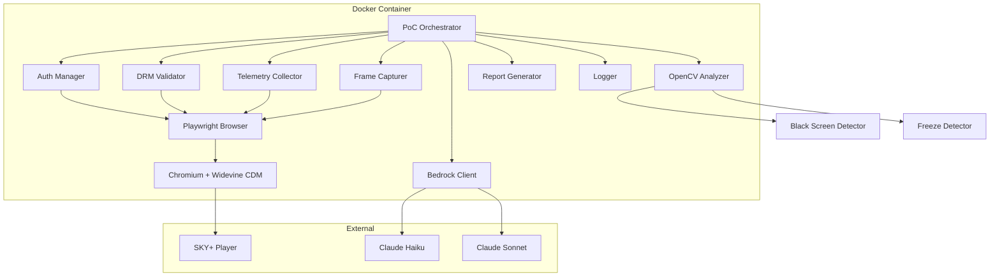
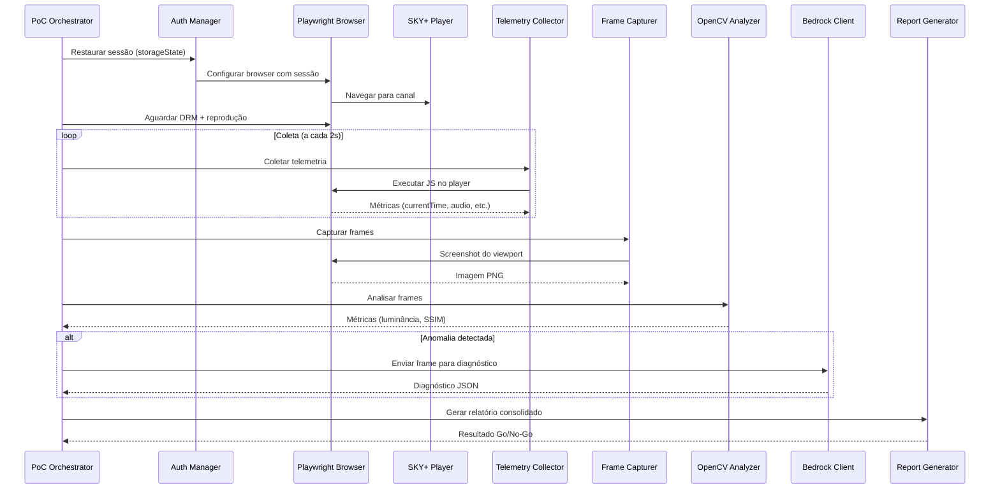
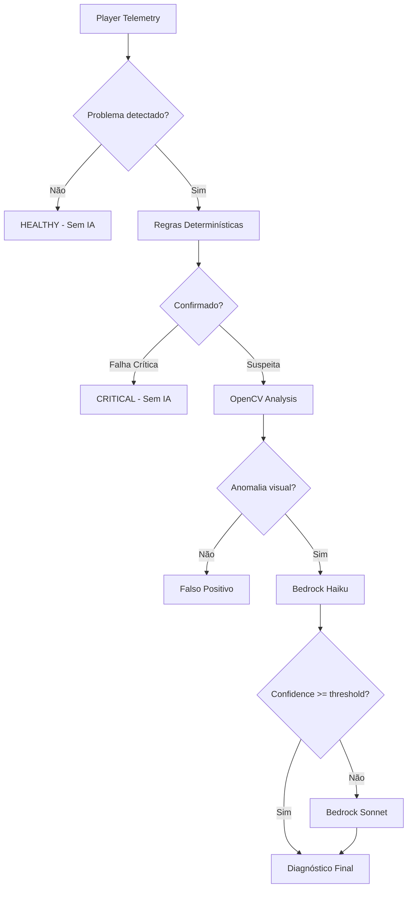
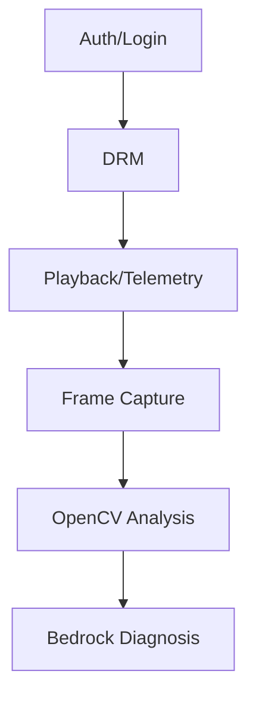

# Design Document — Widevine PoC

## Overview

Este documento detalha o design técnico da Proof of Concept (PoC) para validação do Widevine DRM com Playwright em container Docker. A PoC é a primeira etapa obrigatória antes de investir na infraestrutura de produção do sistema de Monitoramento Inteligente de Canais ao Vivo da plataforma SKY+.

O objetivo central é validar a viabilidade técnica de:
1. Reproduzir conteúdo DRM (Widevine) via Playwright/Chromium
2. Coletar telemetria do player programaticamente
3. Capturar frames de conteúdo protegido
4. Analisar frames com OpenCV (tela preta, freeze)
5. Invocar Amazon Bedrock para diagnóstico visual seletivo
6. Executar todo o pipeline dentro de um container Docker

**Princípio central:** Canal saudável não deve consumir IA.

**Decisão Go/No-Go:** Todas as validações críticas (login, DRM, frames, Docker) devem passar para prosseguir com a infraestrutura de produção.

---

## Architecture

### Diagrama de Arquitetura da PoC



### Fluxo de Execução da PoC



### Hierarquia de Detecção



---

## Components and Interfaces

### 1. PoC Orchestrator (`poc_orchestrator.py`)

Componente principal que orquestra a execução sequencial de todas as validações.

```python
class PoCOrchestrator:
    """Orquestra a execução completa da PoC."""
    
    def __init__(self, config: PoCConfig) -> None: ...
    
    async def run(self) -> PoCReport:
        """Executa todas as validações da PoC em sequência."""
        ...
    
    async def _validate_auth(self) -> ValidationResult: ...
    async def _validate_drm(self) -> ValidationResult: ...
    async def _validate_telemetry(self) -> ValidationResult: ...
    async def _validate_frames(self) -> ValidationResult: ...
    async def _validate_opencv(self) -> ValidationResult: ...
    async def _validate_bedrock(self) -> ValidationResult: ...
```

### 2. Auth Manager (`auth_manager.py`)

Gerencia autenticação e persistência de sessão via storageState.

```python
class AuthManager:
    """Gerencia autenticação na plataforma SKY+."""
    
    def __init__(self, storage_state_path: str) -> None: ...
    
    async def export_storage_state(self, page: Page) -> StorageStateResult:
        """Exporta storageState após login manual."""
        ...
    
    async def restore_session(self, context: BrowserContext) -> SessionResult:
        """Restaura sessão a partir do storageState."""
        ...
    
    def validate_storage_state(self, path: str) -> bool:
        """Valida se o arquivo storageState é válido e não expirado."""
        ...
    
    async def detect_session_expired(self, page: Page) -> bool:
        """Detecta se a sessão expirou (redirect para login ou HTTP 401/403)."""
        ...
```

### 3. DRM Validator (`drm_validator.py`)

Valida a inicialização do Widevine CDM e obtenção de licença DRM.

```python
class DRMValidator:
    """Valida o funcionamento do Widevine DRM."""
    
    def __init__(self, timeout_seconds: int = 15) -> None: ...
    
    async def validate_drm_initialization(self, page: Page) -> DRMResult:
        """Valida criação de MediaKeys e license request."""
        ...
    
    async def wait_for_license(self, page: Page) -> LicenseResult:
        """Aguarda obtenção da licença DRM."""
        ...
    
    async def capture_drm_error(self, page: Page) -> DRMError | None:
        """Captura erro específico do CDM se houver falha."""
        ...
```

### 4. Telemetry Collector (`telemetry_collector.py`)

Coleta métricas do player via JavaScript injection.

```python
class TelemetryCollector:
    """Coleta telemetria do player em tempo real."""
    
    def __init__(self, interval_seconds: float = 2.0) -> None: ...
    
    async def collect_sample(self, page: Page) -> TelemetrySample:
        """Coleta uma amostra completa de telemetria."""
        ...
    
    async def collect_video_metrics(self, page: Page) -> VideoMetrics:
        """Coleta currentTime, readyState, paused, buffered."""
        ...
    
    async def collect_audio_metrics(self, page: Page) -> AudioMetrics:
        """Coleta nível de áudio via Web Audio API."""
        ...
    
    async def collect_subtitle_metrics(self, page: Page) -> SubtitleMetrics:
        """Coleta dados de legendas."""
        ...
    
    async def start_continuous_collection(
        self, page: Page, duration_seconds: float
    ) -> list[TelemetrySample]:
        """Coleta contínua durante um período."""
        ...
```

### 5. Frame Capturer (`frame_capturer.py`)

Captura screenshots do player durante reprodução DRM.

```python
class FrameCapturer:
    """Captura frames do player durante reprodução."""
    
    def __init__(
        self,
        min_interval_seconds: float = 5.0,
        min_resolution: tuple[int, int] = (1280, 720),
        max_size_bytes: int = 5 * 1024 * 1024,
    ) -> None: ...
    
    async def capture_frame(self, page: Page) -> FrameResult:
        """Captura um frame do viewport do player."""
        ...
    
    def validate_frame_content(self, frame_data: bytes) -> FrameValidation:
        """Verifica se o frame contém conteúdo visual (não tela preta DRM)."""
        ...
    
    async def capture_sequence(
        self, page: Page, count: int, interval_seconds: float
    ) -> list[FrameResult]:
        """Captura sequência de frames com intervalo."""
        ...
```

### 6. OpenCV Analyzer (`opencv_analyzer.py`)

Análise visual de frames para detecção de tela preta e freeze.

```python
class OpenCVAnalyzer:
    """Análise visual de frames com OpenCV."""
    
    def __init__(
        self,
        black_screen_threshold: float = 10.0,
        black_pixel_threshold: int = 20,
        black_pixel_percent: float = 95.0,
        variance_threshold: float = 50.0,
        freeze_similarity_threshold: float = 0.98,
    ) -> None: ...
    
    def analyze_luminance(self, frame: np.ndarray) -> LuminanceResult:
        """Calcula média de luminância e percentual de pixels pretos."""
        ...
    
    def detect_black_screen(self, frame: np.ndarray) -> BlackScreenResult:
        """Detecta tela preta vs cena escura legítima."""
        ...
    
    def calculate_frame_similarity(
        self, frame_a: np.ndarray, frame_b: np.ndarray
    ) -> float:
        """Calcula similaridade entre dois frames (SSIM)."""
        ...
    
    def detect_freeze(
        self,
        frame_a: np.ndarray,
        frame_b: np.ndarray,
        current_time_diff: float,
        observation_window_seconds: float = 5.0,
    ) -> FreezeResult:
        """Detecta freeze combinando similaridade visual + telemetria."""
        ...
```

### 7. Bedrock Client (`bedrock_client.py`)

Cliente para chamadas ao Amazon Bedrock (Claude Haiku/Sonnet).

```python
class BedrockClient:
    """Cliente para diagnóstico visual via Amazon Bedrock."""
    
    def __init__(
        self,
        timeout_seconds: int = 30,
        confidence_threshold: float = 0.7,
        region: str = "us-east-1",
    ) -> None: ...
    
    async def diagnose_frame(
        self, frame_data: bytes, anomaly_confirmed: bool
    ) -> DiagnosisResult:
        """Envia frame para diagnóstico. Rejeita se anomalia não confirmada."""
        ...
    
    async def _invoke_haiku(self, frame_b64: str) -> DiagnosisResult:
        """Invoca Claude Haiku para diagnóstico."""
        ...
    
    async def _invoke_sonnet(self, frame_b64: str) -> DiagnosisResult:
        """Invoca Claude Sonnet para casos de baixa confiança."""
        ...
    
    def _parse_response(self, response: dict) -> DiagnosisResult:
        """Parseia e valida resposta JSON do Bedrock."""
        ...
```

### 8. Buffering Detector (`buffering_detector.py`)

Detecta buffering persistente do player.

```python
class BufferingDetector:
    """Detecta buffering persistente do player."""
    
    def __init__(self, threshold_seconds: float = 10.0) -> None: ...
    
    def update(self, sample: TelemetrySample) -> BufferingState:
        """Atualiza estado de buffering com nova amostra."""
        ...
    
    def is_persistent(self) -> bool:
        """Verifica se buffering excedeu threshold."""
        ...
    
    def reset(self) -> None:
        """Reseta estado quando player volta a reproduzir."""
        ...
```

### 9. Report Generator (`report_generator.py`)

Gera relatório consolidado com decisão Go/No-Go.

```python
class ReportGenerator:
    """Gera relatório consolidado da PoC."""
    
    def generate(self, results: list[ValidationResult]) -> PoCReport:
        """Gera relatório com status de cada validação."""
        ...
    
    def classify_go_nogo(self, report: PoCReport) -> GoNoGoDecision:
        """Classifica resultado geral como GO ou NO_GO."""
        ...
    
    def save_report(self, report: PoCReport, output_path: str) -> None:
        """Salva relatório em formato JSON."""
        ...
```

### 10. Structured Logger (`structured_logger.py`)

Logger estruturado em formato JSON.

```python
class StructuredLogger:
    """Logger estruturado em formato JSON para stdout."""
    
    def __init__(self, min_level: str = "INFO") -> None: ...
    
    def log(
        self,
        level: str,
        stage_id: str,
        message: str,
        data: dict | None = None,
    ) -> None:
        """Registra log estruturado com timestamp ISO 8601."""
        ...
    
    def debug(self, stage_id: str, message: str, **kwargs) -> None: ...
    def info(self, stage_id: str, message: str, **kwargs) -> None: ...
    def warning(self, stage_id: str, message: str, **kwargs) -> None: ...
    def error(self, stage_id: str, message: str, **kwargs) -> None: ...
```

---

## Data Models

### Configuração da PoC

```python
from dataclasses import dataclass, field
from enum import Enum
from typing import Optional


@dataclass
class PoCConfig:
    """Configuração principal da PoC."""
    storage_state_path: str
    channel_url: str
    output_dir: str = "./output"
    log_level: str = "INFO"
    # Timeouts
    session_restore_timeout: int = 15  # segundos
    drm_timeout: int = 15  # segundos
    playback_timeout: int = 30  # segundos
    bedrock_timeout: int = 30  # segundos
    docker_startup_timeout: int = 60  # segundos
    # Telemetria
    telemetry_interval: float = 2.0  # segundos
    telemetry_duration: float = 30.0  # segundos
    # Frames
    frame_interval: float = 5.0  # segundos
    frame_min_resolution: tuple[int, int] = (1280, 720)
    frame_max_size: int = 5 * 1024 * 1024  # 5 MB
    # OpenCV
    black_screen_luminance_threshold: float = 10.0
    black_pixel_value_threshold: int = 20
    black_pixel_percent_threshold: float = 95.0
    variance_threshold: float = 50.0
    freeze_similarity_threshold: float = 0.98
    freeze_observation_window: float = 5.0  # segundos
    # Buffering
    buffering_threshold: float = 10.0  # segundos
    # Bedrock
    bedrock_region: str = "us-east-1"
    bedrock_confidence_threshold: float = 0.7
```

### Estrutura de Telemetria

```python
@dataclass
class VideoMetrics:
    """Métricas de vídeo do player."""
    current_time: float
    video_width: int
    video_height: int
    ready_state: int
    paused: bool
    error: Optional[str]
    buffered_seconds: float


@dataclass
class AudioMetrics:
    """Métricas de áudio do player."""
    average_level: Optional[float]  # 0.0 a 100.0, None se indisponível
    peak_level: Optional[float]  # 0.0 a 100.0, None se indisponível
    is_muted: bool
    unavailable: bool = False


@dataclass
class SubtitleMetrics:
    """Métricas de legendas do player."""
    tracks_available: int
    active_track: Optional[str]
    has_active_cues: bool


@dataclass
class PlayerMetrics:
    """Estado geral do player."""
    playing: bool
    buffering: bool
    drm_ok: bool


@dataclass
class TelemetrySample:
    """Amostra completa de telemetria."""
    timestamp: str  # ISO 8601
    channel_id: str
    video: VideoMetrics
    audio: AudioMetrics
    subtitles: SubtitleMetrics
    player: PlayerMetrics
```

### Resultados de Validação

```python
class ValidationStatus(Enum):
    PASS = "PASS"
    FAIL = "FAIL"
    SKIPPED = "SKIPPED"


class GoNoGoDecision(Enum):
    GO = "GO"
    NO_GO = "NO_GO"


@dataclass
class ValidationResult:
    """Resultado de uma validação individual."""
    name: str
    status: ValidationStatus
    start_time: str  # ISO 8601
    end_time: str  # ISO 8601
    duration_ms: int
    error_message: Optional[str] = None
    evidence_paths: list[str] = field(default_factory=list)
    metrics: dict = field(default_factory=dict)
    skipped_reason: Optional[str] = None
```

### Resultados de Análise

```python
@dataclass
class DRMResult:
    """Resultado da validação de DRM."""
    media_keys_created: bool
    license_requested: bool
    license_obtained: bool
    time_to_license_ms: int
    error: Optional[str] = None


@dataclass
class LuminanceResult:
    """Resultado da análise de luminância."""
    mean_luminance: float  # 0-255
    black_pixel_percent: float  # 0-100
    pixel_variance: float


@dataclass
class BlackScreenResult:
    """Resultado da detecção de tela preta."""
    is_black_screen: bool
    is_dark_scene: bool  # Cena escura legítima
    luminance: LuminanceResult


class FreezeClassification(Enum):
    NO_FREEZE = "NO_FREEZE"
    FREEZE_CONFIRMED = "FREEZE_CONFIRMED"
    STATIC_CONTENT = "STATIC_CONTENT"
    ANALYSIS_ERROR = "ANALYSIS_ERROR"


@dataclass
class FreezeResult:
    """Resultado da detecção de freeze."""
    classification: FreezeClassification
    similarity: float
    current_time_diff: float
    observation_window_seconds: float


class BufferingClassification(Enum):
    NO_BUFFERING = "NO_BUFFERING"
    BUFFERING_NORMAL = "BUFFERING_NORMAL"
    BUFFERING_PERSISTENT = "BUFFERING_PERSISTENT"


@dataclass
class BufferingState:
    """Estado atual de buffering."""
    classification: BufferingClassification
    duration_seconds: float
    start_time: Optional[str] = None


class DiagnosisStatus(Enum):
    OK = "OK"
    DEGRADED = "DEGRADED"
    UNKNOWN = "UNKNOWN"


@dataclass
class DiagnosisResult:
    """Resultado do diagnóstico via Bedrock."""
    status: DiagnosisStatus
    diagnosis: str
    issues: list[str]
    description: str
    confidence: float  # 0.0 a 1.0
    model_used: str  # "haiku" ou "sonnet"
    response_time_ms: int
    escalated: bool = False  # Se foi escalado para Sonnet
```

### Relatório da PoC

```python
@dataclass
class PerformanceMetrics:
    """Métricas de performance da PoC."""
    browser_init_time_ms: int
    drm_ready_time_ms: int
    time_per_frame_ms: int
    bedrock_response_time_ms: Optional[int]


@dataclass
class PoCReport:
    """Relatório consolidado da PoC."""
    execution_id: str
    start_time: str  # ISO 8601
    end_time: str  # ISO 8601
    total_duration_ms: int
    decision: GoNoGoDecision
    validations: list[ValidationResult]
    performance: PerformanceMetrics
    log_file_path: str
    environment: dict  # Versões de Playwright, Chromium, Python, OpenCV


@dataclass
class LogEntry:
    """Entrada de log estruturada."""
    timestamp: str  # ISO 8601 com milissegundos
    level: str  # DEBUG, INFO, WARNING, ERROR
    stage_id: str
    message: str
    data: Optional[dict] = None
```

### Dockerfile

```dockerfile
FROM mcr.microsoft.com/playwright/python:v1.40.0-jammy

# Dependências de sistema para Widevine
RUN apt-get update && apt-get install -y \
    libnss3 \
    libatk1.0-0 \
    libatk-bridge2.0-0 \
    libgbm1 \
    libasound2 \
    libxrandr2 \
    libpango-1.0-0 \
    libcairo2 \
    && rm -rf /var/lib/apt/lists/*

# Dependências Python
COPY requirements.txt /app/requirements.txt
RUN pip install --no-cache-dir -r /app/requirements.txt

# Código da PoC
COPY src/ /app/src/
WORKDIR /app

# Instalar browsers com Widevine
RUN playwright install chromium

# Variáveis de ambiente padrão
ENV LOG_LEVEL=INFO
ENV DISPLAY=:99

ENTRYPOINT ["python", "-m", "src.poc_orchestrator"]
```

### Estrutura de Diretórios

```
widevine-poc/
├── src/
│   ├── __init__.py
│   ├── poc_orchestrator.py
│   ├── auth_manager.py
│   ├── drm_validator.py
│   ├── telemetry_collector.py
│   ├── frame_capturer.py
│   ├── opencv_analyzer.py
│   ├── bedrock_client.py
│   ├── buffering_detector.py
│   ├── report_generator.py
│   ├── structured_logger.py
│   ├── models.py            # Data models
│   └── config.py            # PoCConfig
├── tests/
│   ├── __init__.py
│   ├── test_opencv_analyzer.py
│   ├── test_telemetry_collector.py
│   ├── test_buffering_detector.py
│   ├── test_bedrock_client.py
│   ├── test_report_generator.py
│   └── conftest.py
├── output/                  # Relatórios e evidências
├── Dockerfile
├── docker-compose.yml
├── requirements.txt
├── pytest.ini
└── README.md
```

---


## Correctness Properties

*Uma propriedade é uma característica ou comportamento que deve ser verdadeiro em todas as execuções válidas de um sistema — essencialmente, uma declaração formal sobre o que o sistema deve fazer. Propriedades servem como ponte entre especificações legíveis por humanos e garantias de correção verificáveis por máquina.*

### Property 1: Detecção de sessão expirada

*Para qualquer* resposta HTTP com status 401 ou 403, ou qualquer redirecionamento para uma URL contendo padrão de página de login, o sistema SHALL classificar o storageState como expirado.

**Validates: Requirements 1.4**

### Property 2: Validação de progressão do currentTime

*Para qualquer* par de amostras de telemetria consecutivas coletadas com intervalo de 2 segundos durante reprodução ativa, a diferença de currentTime entre as amostras SHALL ser de pelo menos 1 segundo. Se a diferença for menor que 0.5 segundos, o estado SHALL ser classificado como potencial stall.

**Validates: Requirements 2.3**

### Property 3: Completude da estrutura de telemetria

*Para qualquer* amostra de telemetria coletada, o objeto JSON resultante SHALL conter as seções `video` (com currentTime float, readyState int, paused bool, buffered_seconds float), `audio` (com average_level float|null em [0.0, 100.0], peak_level float|null em [0.0, 100.0]), `subtitles` (com tracks_available int >= 0, active_track string|null, has_active_cues bool) e `player` (com playing bool, buffering bool, drm_ok bool).

**Validates: Requirements 3.1, 3.2, 3.3, 3.4**

### Property 4: Validação de resolução e tamanho de frame

*Para qualquer* frame capturado, o sistema SHALL aceitar frames com resolução >= 1280x720 pixels E tamanho <= 5 MB, e SHALL rejeitar frames que não atendam ambos os critérios.

**Validates: Requirements 4.2**

### Property 5: Validação de intervalo de captura

*Para qualquer* valor de intervalo configurado para captura de frames, o sistema SHALL aceitar valores no range [1, 60] segundos e SHALL rejeitar valores fora desse range.

**Validates: Requirements 4.3**

### Property 6: Classificação de luminância de frame

*Para qualquer* frame capturado, se a média de luminância excede 16 (escala 0-255), o sistema SHALL classificar como contendo conteúdo visual. Se a média de luminância é igual ou inferior a 16, SHALL classificar como tela preta potencial e descartar da análise.

**Validates: Requirements 4.4, 4.5**

### Property 7: Classificação de tela preta vs cena escura

*Para qualquer* frame em escala de cinza, o sistema SHALL classificar como BLACK_SCREEN se e somente se a média de luminância < threshold (default 10) E o percentual de pixels com valor < 20 excede 95% E a variância dos pixels é <= 50. Se a variância é > 50 (distribuição não uniforme), SHALL classificar como cena escura legítima, independente da luminância.

**Validates: Requirements 5.1, 5.2, 5.3**

### Property 8: Tratamento de frames inválidos

*Para qualquer* frame inválido (dimensões zero, dados corrompidos, formato não suportado, ou None), o OpenCV_Analyzer SHALL retornar status ANALYSIS_ERROR sem exceção não tratada e sem classificar o frame.

**Validates: Requirements 5.4, 6.4**

### Property 9: Classificação de freeze

*Para quaisquer* dois frames válidos de mesmas dimensões, o sistema SHALL produzir similaridade no range [0.0, 1.0]. Se similaridade > 0.98 E currentTime diff < 0.5s ao longo de janela >= 5s, SHALL classificar como FREEZE_CONFIRMED. Se similaridade > 0.98 MAS currentTime diff >= 0.5s, SHALL classificar como STATIC_CONTENT (sem alerta).

**Validates: Requirements 6.1, 6.2, 6.3**

### Property 10: Classificação de buffering

*Para qualquer* sequência de estados do player, se o estado permanece em waiting/stalled por mais tempo que o threshold (default 10s) sem transição para playing com currentTime avançando, SHALL classificar como BUFFERING_PERSISTENT. Se a transição para playing ocorre dentro do threshold, SHALL classificar como BUFFERING_NORMAL.

**Validates: Requirements 7.1, 7.2, 7.3**

### Property 11: Parsing de resposta do Bedrock

*Para qualquer* resposta do Bedrock, se é JSON válido contendo os campos status (OK|DEGRADED|UNKNOWN), diagnosis (string), issues (lista), description (string), e confidence (float 0.0-1.0), o parser SHALL produzir um DiagnosisResult válido. Para qualquer resposta inválida (não-JSON, campos faltando, tipos incorretos), SHALL retornar status=UNKNOWN com confidence=0.0.

**Validates: Requirements 8.2, 8.4**

### Property 12: Lógica de escalação Haiku → Sonnet

*Para qualquer* resultado do Haiku, se confidence < threshold configurado, o sistema SHALL escalar para Sonnet. Se confidence >= threshold, SHALL utilizar o resultado do Haiku sem escalação.

**Validates: Requirements 8.5**

### Property 13: Gate de pré-requisito para Bedrock

*Para qualquer* requisição ao Bedrock_Client onde anomaly_confirmed=False, o sistema SHALL rejeitar a requisição imediatamente sem realizar chamada à API do Bedrock.

**Validates: Requirements 8.6**

### Property 14: Formato de log estruturado

*Para qualquer* invocação de log com qualquer combinação de level, stage_id, message e data, a saída SHALL ser JSON válido contendo os campos timestamp (ISO 8601 com milissegundos), level, stage_id, message, e data (quando fornecido). Erros SHALL incluir adicionalmente stack_trace.

**Validates: Requirements 10.1, 10.9, 10.10**

### Property 15: Estrutura do relatório

*Para qualquer* conjunto de ValidationResults, o relatório gerado SHALL conter cada validação com status (PASS|FAIL|SKIPPED), start_time, end_time, e duration_ms. Para validações com status=FAIL, SHALL incluir error_message não-vazio e evidence_paths.

**Validates: Requirements 11.1, 11.2**

### Property 16: Decisão Go/No-Go

*Para qualquer* conjunto de resultados de validação, se todas as validações críticas (login, DRM, frames, Docker) têm status=PASS, a decisão SHALL ser GO. Se qualquer validação crítica tem status=FAIL, a decisão SHALL ser NO_GO.

**Validates: Requirements 11.4**

### Property 17: Lógica de skip por dependência

*Para qualquer* validação cuja dependência falhou (status=FAIL na validação anterior requerida), o status SHALL ser SKIPPED com skipped_reason indicando qual dependência impediu a execução.

**Validates: Requirements 11.6**

---

## Error Handling

### Estratégia de Tratamento de Erros

A PoC segue uma filosofia de **fail-forward**: erros em uma etapa são registrados e reportados, mas não necessariamente impedem a execução de etapas independentes.

### Cadeia de Dependências



Se uma etapa falha, etapas dependentes são marcadas como SKIPPED.

### Classificação de Erros

| Tipo | Comportamento | Exemplo |
|------|---------------|---------|
| CRITICAL | Para a cadeia, etapas dependentes = SKIPPED | DRM falha, sessão expirada |
| RECOVERABLE | Retry interno, continua se recuperar | Timeout em coleta de telemetria |
| DEGRADED | Continua com dados parciais | Áudio indisponível, legenda não detectada |
| EXTERNAL | Registra e retorna UNKNOWN | Bedrock timeout, API error |

### Tratamento por Componente

| Componente | Erro | Ação |
|------------|------|------|
| AuthManager | StorageState inválido/expirado | Log ERROR, skip cadeia DRM+ |
| DRMValidator | CDM falha, licença timeout | Log ERROR com detalhes CDM, skip playback+ |
| TelemetryCollector | Player error event | Captura em ≤500ms, registra no relatório |
| TelemetryCollector | Web Audio API indisponível | Registra null, continua com dados parciais |
| FrameCapturer | Frame é tela preta (DRM protection) | Log WARNING, descarta, tenta novamente |
| FrameCapturer | Resolução insuficiente | Log WARNING, descarta frame |
| OpenCVAnalyzer | Frame inválido/corrompido | Retorna ANALYSIS_ERROR, não classifica |
| OpenCVAnalyzer | Frames com dimensões diferentes | Log ERROR, não compara, não classifica freeze |
| BedrockClient | Timeout 30s | Retorna UNKNOWN confidence=0.0 |
| BedrockClient | Resposta não-JSON | Log ERROR com conteúdo, retorna UNKNOWN |
| BedrockClient | Anomalia não confirmada | Rejeita sem chamar API |
| BufferingDetector | ReadyState inesperado | Log WARNING, mantém monitoramento ativo |
| Docker | Widevine falha no container | Log ERROR com bibliotecas e permissões |

### Timeouts

| Operação | Timeout | Ação no Timeout |
|----------|---------|-----------------|
| Restauração de sessão | 15s | Classificar como sessão inválida |
| Inicialização DRM | 15s | DRM_ERROR |
| Playback ready | 30s | PLAYBACK_ERROR |
| Captura de erro do player | 500ms | Registrar timeout na captura |
| Chamada Bedrock | 30s | Retornar UNKNOWN |
| Docker startup (Chromium + DRM) | 60s | DOCKER_ERROR |

---

## Testing Strategy

### Abordagem Dual: Unit Tests + Property-Based Tests

A PoC utiliza uma abordagem combinada de testes:

1. **Property-Based Tests (PBT)**: Validam propriedades universais dos componentes de lógica pura (OpenCV, detecção, parsing, classificação)
2. **Unit Tests**: Cobrem exemplos específicos, edge cases e mocks de integrações externas
3. **Integration Tests**: Validam o sistema completo contra a plataforma real e dentro do Docker

### Biblioteca PBT

- **Biblioteca**: [Hypothesis](https://hypothesis.readthedocs.io/) (Python)
- **Configuração**: Mínimo 100 iterações por propriedade (`@settings(max_examples=100)`)
- **Tag format**: `# Feature: widevine-poc, Property {N}: {description}`

### Mapa de Testes por Componente

| Componente | Property Tests | Unit Tests | Integration Tests |
|------------|---------------|------------|-------------------|
| OpenCVAnalyzer | Props 7, 8, 9 | Exemplos com imagens reais | - |
| TelemetryCollector | Props 2, 3 | Mocks de player state | Coleta real de telemetria |
| FrameCapturer | Props 4, 5, 6 | Mock de screenshot | Captura real com DRM |
| BedrockClient | Props 11, 12, 13 | Mocks de API responses | Chamada real ao Bedrock |
| BufferingDetector | Prop 10 | Sequências de eventos | - |
| StructuredLogger | Prop 14 | Exemplos de formato | - |
| ReportGenerator | Props 15, 16, 17 | Exemplos de relatório | - |
| AuthManager | Prop 1 | Mock de HTTP responses | Login real na plataforma |
| DRMValidator | - | Mock de CDM events | DRM real no Docker |
| PoCOrchestrator | - | Mock end-to-end | Execução completa no Docker |

### Estratégia de Generators (Hypothesis)

```python
# Generators para property tests
from hypothesis import strategies as st

# Frames (numpy arrays)
frame_strategy = st.builds(
    np.random.randint,
    low=st.just(0),
    high=st.just(256),
    size=st.tuples(
        st.integers(min_value=1, max_value=2160),
        st.integers(min_value=1, max_value=3840),
    ),
    dtype=st.just(np.uint8),
)

# Telemetria
telemetry_strategy = st.builds(
    TelemetrySample,
    timestamp=st.text(min_size=20, max_size=30),
    channel_id=st.text(min_size=1, max_size=20),
    video=st.builds(VideoMetrics, ...),
    audio=st.builds(AudioMetrics, ...),
    subtitles=st.builds(SubtitleMetrics, ...),
    player=st.builds(PlayerMetrics, ...),
)

# Respostas Bedrock
bedrock_response_strategy = st.fixed_dictionaries({
    "status": st.sampled_from(["OK", "DEGRADED", "UNKNOWN"]),
    "diagnosis": st.text(min_size=1),
    "issues": st.lists(st.text(min_size=1)),
    "description": st.text(min_size=1),
    "confidence": st.floats(min_value=0.0, max_value=1.0),
})
```

### Testes de Integração (Docker)

Os testes de integração validam o sistema completo dentro do container Docker:

1. **Smoke test**: Container builda e inicia, Chromium + Widevine carregam
2. **Auth test**: storageState montado como volume restaura sessão
3. **DRM test**: Licença Widevine obtida dentro do container
4. **Playback test**: currentTime avança, telemetria coletada
5. **Frame test**: Screenshots capturados com conteúdo visual
6. **OpenCV test**: Métricas de análise produzidas
7. **E2E test**: Pipeline completo gera relatório Go/No-Go

### Execução de Testes

```bash
# Unit + Property tests (locais, sem dependências externas)
pytest tests/ -v --hypothesis-seed=0

# Integration tests (requerem plataforma real)
pytest tests/integration/ -v -m integration

# Docker tests
docker build -t widevine-poc .
docker run --rm -v ./storage_state.json:/app/storage_state.json widevine-poc
```

### Cobertura Esperada

- **Lógica pura** (OpenCV, parsing, classificação): > 95% via property tests
- **Componentes com I/O** (Bedrock, Playwright): > 80% via unit tests com mocks
- **Sistema completo**: Validado via integration tests no Docker
